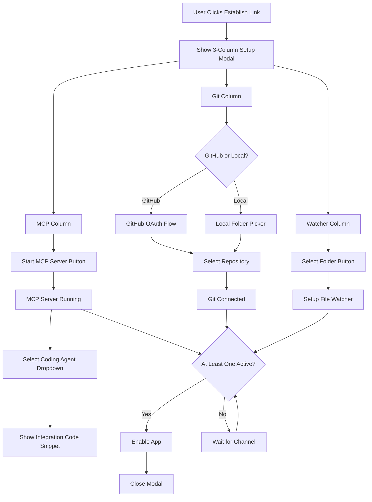
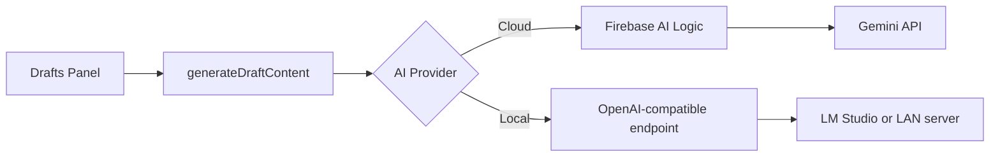

# BRICK Comprehensive Implementation Plan

This document combines all implementation plans, setup guides, and documentation for the BRICK project.

---

# Table of Contents

1. [Input & Output Channels Implementation Plan](#input--output-channels-implementation-plan)
2. [Global Channel Components Setup](#global-channel-components-setup)
3. [OAuth Setup Guide](#oauth-setup-guide)
4. [OAuth Implementation Fix Guide](#oauth-implementation-fix-guide)
5. [Native App OAuth Setup](#native-app-oauth-setup)
6. [Electron Desktop App Setup](#electron-desktop-app-setup)
7. [App Store & Play Store Distribution](#app-store--play-store-distribution)
8. [Simulated Endpoints & Mock Data Analysis](#simulated-endpoints--mock-data-analysis)
9. [AI Provider Setup (Firebase AI & Local)](#ai-provider-setup-firebase-ai--local)
10. [Simulation Documentation](#simulation-documentation)
11. [README](#readme)
12. [Human Todo List](#human-todo-list)

---

# Input & Output Channels Implementation Plan

## Overview

This plan covers both **Input Channels** (how content comes into BRICK) and **Output Channels** (where BRICK posts content).

### Input Channels
Implement a unified setup modal with three columns (one per input channel) that appears when user clicks "Establish Link". Each column handles its own configuration: MCP server with agent integration instructions, Git repository selection via GitHub OAuth or local folder, and folder watching via folder picker.

### Output Channels
Implement real OAuth flows in the onboarding process to connect user accounts on X, Reddit, Discord, and Email. These connections allow BRICK to post content on behalf of the user. Reference implementation: [contentport](https://github.com/joschan21/contentport) for X/Twitter OAuth example.

**Channel Requirements:**
- At least **one** channel must be connected to enable the app
- **No specific channel is required** - user can connect just MCP, just Git, just Watcher, or any combination
- **More channels are helpful** - they provide better context for draft generation, but are optional
- The app should work gracefully with any combination of connected channels

## Architecture Flow



## Implementation Steps

### 1. Create MCP Server Service

**File**: `services/mcpServerService.ts`

Create an MCP server that runs inside the BRICK app:

- `startMCPServer(port: number)` - Start MCP server on LAN (supports both WebSocket and HTTP)
- `stopMCPServer()` - Stop the server
- `getServerUrl()` - Get server URLs (returns both WebSocket `ws://` and HTTP `http://` URLs for code snippets)
- `getServerStatus()` - Check if server is running
- `onContextReceived(callback)` - Handle incoming summaries from coding agents

**MCP Protocol Implementation:**
- **Dual transport support:**
  - WebSocket server (for Cursor) - `ws://YOUR_IP:3000`
  - HTTP server (for Claude Code) - `http://YOUR_IP:3000/mcp`
- Listen on configurable port (default: 3000)
- Handle JSON-RPC requests from coding agents via both transports
- **Expose MCP tool: `log_progress`**
  - **Name**: `log_progress`
  - **Description**: "Send a short, clear summary of what you just did or are about to do in the code. This will be used to generate social/media posts about your work."
  - **Parameters**: 
    ```json
    {
      "type": "object",
      "properties": {
        "summary": {
          "type": "string",
          "description": "A concise, natural-language summary of the change or decision. E.g., 'Converted class components to functional components in Onboarding flow' or 'Added error boundaries and fallback UI'. Keep under 120 characters."
        }
      },
      "required": ["summary"]
    }
    ```
  - When called by agent → triggers draft generation in BRICK
- Receive concise summaries of code changes/decisions (not raw reasoning streams)
- Broadcast events to app when `log_progress` tool is called

**Dependencies:**
- `@capacitor/http` or HTTP server capability for HTTP transport
- `ws` package (if Node.js runtime available) for WebSocket transport
- Or use Capacitor's HTTP server capability with WebSocket upgrade support

### 2. Create Agent Configuration Templates

**File**: `services/agentConfigTemplates.ts`

Store code snippets for different coding agents. Each agent needs TWO snippets:
1. Connection config (how to connect to BRICK's MCP server)
2. Rule/instruction (how to automatically call the `log_progress` tool)

- `getConnectionConfig(agentType: AgentType): string` - Get connection config snippet
- `getRuleInstruction(agentType: AgentType): string` - Get rule/instruction snippet
- Agent types: Cursor, Claude Code, Gemini CLI, Google Antigravity

**Example formats:**

**Cursor:**

**Connection Config** (add to `~/.cursor/mcp.json` or `<project-root>/.cursor/mcp.json`):
```json
{
  "mcpServers": {
    "brick": {
      "url": "ws://YOUR_IP:3000"
    }
  }
}
```

**Rule/Instruction** (add to `.cursorrules` or Rules settings):
```
After completing a code change or major refactoring, always call the 'log_progress' tool on the BRICK server with a short, clear summary of what you did. Keep it under 120 characters and written like a dev update (e.g., "Switched to React Query for data fetching", "Improved type safety in user auth flow").
Do this automatically — do not ask for permission.
```

**Claude Code:**

**Connection Config** (run in terminal):
```bash
claude mcp add --transport http brick http://YOUR_IP:3000/mcp
```
Uses HTTP transport (not WebSocket).

**Custom Instruction** (add to Custom Instructions in settings):
```
You are connected to BRICK via MCP. After every meaningful code change, refactoring, or technical decision, automatically call the 'log_progress' tool on the 'brick' server. Send a concise summary (1 sentence) of what you accomplished. Example: "Replaced Redux with Zustand for global state in the mobile app".
Do this without asking — it's for automatic post drafting.
```

**Gemini CLI**: (TBD - format to be determined)
**Google Antigravity**: (TBD - format to be determined)

The snippets should include:
- The server URL (with actual IP address from BRICK's MCP server)
- For Cursor: WebSocket URL (`ws://`) + rule for `.cursorrules`
- For Claude Code: HTTP URL (`http://`) with `/mcp` endpoint + custom instruction
- Clear instructions on where to add each snippet
- Note: "After setup, BRICK will automatically receive updates whenever your agent makes changes."

### 3. Create Git Service with GitHub OAuth

**File**: `services/gitService.ts`

Handle both GitHub and local git repos:

- `connectGitHub()` - Initiate GitHub OAuth flow
- `handleGitHubCallback(code: string)` - Handle OAuth callback
- `listGitHubRepos()` - List user's GitHub repositories
- `selectGitHubRepo(repo: string)` - Connect to selected repo
- `selectLocalRepo(folderPath: string)` - Connect to local git repo
- `setupGitHooks()` - Install git hooks to capture commits
- `onCommit(callback)` - Handle commit events

**GitHub OAuth Flow:**
- Use GitHub OAuth app credentials
- Redirect to GitHub authorization
- Handle callback with authorization code
- Exchange for access token
- Use GitHub API to list repositories

**Dependencies:**
- `@capacitor/browser` - For OAuth redirect
- `@octokit/rest` - GitHub API client
- Or use Capacitor HTTP plugin for API calls

### 4. Create File Watcher Service

**File**: `services/fileWatcherService.ts`

Watch folders for file changes:

- `selectFolder()` - Open Capacitor folder picker
- `watchFolder(folderPath: string)` - Start watching folder
- `stopWatching(folderPath: string)` - Stop watching
- `getWatchedFolders()` - List all watched folders
- `onFileChange(callback)` - Handle file change events

**Implementation:**
- Use `@capacitor/filesystem` for folder picker
- Use file system watcher or polling to detect changes
- Filter by file extensions (`.ts`, `.tsx`, `.js`, etc.)
- Respect privacy patterns (ignore `.env`, `secrets/*`)
- Emit events when files change

### 5. Create Setup Modal Component

**File**: `components/InputChannelsSetupModal.tsx`

Three-column modal layout:

**Column 1 - MCP Server:**
- "Start MCP Server" button (shows status: Stopped/Running)
- Dropdown: Select Coding Agent (Cursor, Claude Code, Gemini CLI, Google Antigravity)
- **Two copyable blocks displayed:**
  1. **Connection Config** - JSON config or CLI command (based on agent)
     - **Cursor**: JSON config snippet for `.cursor/mcp.json` (WebSocket URL)
     - **Claude Code**: CLI command to run in terminal (HTTP URL)
     - **Other agents**: TBD format
  2. **Rule/Instruction** - The rule or custom instruction to add
     - **Cursor**: Rule for `.cursorrules` file
     - **Claude Code**: Custom instruction for settings
     - **Other agents**: TBD format
- Copy buttons for each snippet (separate copy buttons)
- Instructions text:
  - **Cursor**: "1. Add connection config to `.cursor/mcp.json` 2. Add rule to `.cursorrules`"
  - **Claude Code**: "1. Run connection command in terminal 2. Add custom instruction to settings"
- Status indicator: Server URL (shows both WebSocket and HTTP endpoints), connection count
- Note: "After setup, BRICK will automatically receive updates whenever your agent makes changes."

**Column 2 - Git Repository:**
- Toggle/Radio: "GitHub" or "Local Folder"
- If GitHub:
  - "Connect GitHub" button (opens OAuth flow)
  - Repository dropdown (populated after OAuth)
  - "Select Repository" button
- If Local Folder:
  - "Select Git Repository" button (opens folder picker)
- Status indicator: Connected repo path/name

**Column 3 - Folder Watcher:**
- "Select Folder to Watch" button (opens folder picker)
- List of watched folders (with remove buttons)
- "Add Another Folder" button
- Status indicator: Number of folders watched

**Modal Footer:**
- "Done" button (enabled when at least one channel is active - any channel works)
- "Cancel" button
- Note: At least one channel must be connected, but no specific channel is required. More channels provide better context but are optional.

### 6. Update App.tsx - Open Modal

**File**: `App.tsx`

Replace the boolean toggle with modal state:

```typescript
const [showSetupModal, setShowSetupModal] = useState(false);
const [inputChannels, setInputChannels] = useState<InputChannelStatus>({
  mcp: { active: false, serverUrl: null },
  git: { active: false, repoPath: null },
  watcher: { active: false, folders: [] }
});

const handleEstablishLink = () => {
  setShowSetupModal(true);
};

const handleSetupComplete = (channels: InputChannelStatus) => {
  // Validate: at least one channel must be active
  const hasActiveChannel = 
    channels.mcp.active || 
    channels.git.active || 
    channels.watcher.active;
  
  if (!hasActiveChannel) {
    // Show error: "Please connect at least one channel"
    return;
  }
  
  setInputChannels(channels);
  setShowSetupModal(false);
  // Enable app features (works with any combination of channels)
};
```

### 7. Create Input Channels Context

**File**: `contexts/InputChannelsContext.tsx`

Provide channel state and events throughout app:

- Channel status (active/inactive, details)
- MCP context events → trigger draft generation
- Git commit events → trigger draft generation
- File change events → trigger draft generation

### 8. Update DraftsPanel to Use Real Context

**File**: `components/DraftsPanel.tsx`

Replace `SAMPLE_CODE_SNIPPET` with real context:

- Listen to InputChannelsContext
- When MCP `log_progress` tool is called → receive summary → use for draft generation
- When git commit → capture commit message + diff
- When file changes → capture diff
- Display context source: "New context from agent: 'Migrated to TypeScript strict mode'"

### 9. Update Settings Panel

**File**: `components/SettingsPanel.tsx`

Replace protocol toggles with real status:

- Show MCP server status (running/stopped, URL, connections)
- Show Git repo (GitHub repo name or local path)
- List watched folders (with remove buttons)
- "Reconfigure" button → opens setup modal again

### 10. State Persistence

**File**: `services/storageService.ts`

Use Capacitor Preferences to persist:

- MCP server port and status
- Selected coding agent type
- GitHub access token (encrypted)
- Selected GitHub repo or local git path
- Watched folder paths
- Channel enable/disable states

## File Structure

```
services/
  ├── mcpServerService.ts          # MCP server implementation
  ├── agentConfigTemplates.ts       # Agent config code snippets
  ├── gitService.ts                 # GitHub OAuth + local git
  ├── fileWatcherService.ts         # File watching
  └── storageService.ts             # Persistence

components/
  ├── InputChannelsSetupModal.tsx   # 3-column setup modal
  └── (update) SettingsPanel.tsx    # Show real status

contexts/
  └── InputChannelsContext.tsx      # React context for channels

types/
  └── inputChannels.ts              # Type definitions
```

## User Flow

1. User clicks "Establish Link" → Modal opens with 3 columns
2. **Column 1 (MCP):**
   - Click "Start MCP Server" → Server starts, shows URL
   - Select coding agent from dropdown
   - **Two snippets appear:**
     - Connection config → User copies and adds to agent config
     - Rule/instruction → User copies and adds to agent rules/instructions
   - After setup, agent will automatically call `log_progress` tool when making changes
3. **Column 2 (Git):**
   - Choose "GitHub" or "Local Folder"
   - If GitHub → OAuth flow → Select repo
   - If Local → Folder picker → Select git repo folder
4. **Column 3 (Folder Watcher):**
   - Click "Select Folder" → Folder picker → Select folder
   - Folder appears in list
   - Can add more folders
5. Click "Done" → Modal closes, app enabled (requires at least one channel active)
   - User can connect any combination: just MCP, just Git, just Watcher, or any combination
   - More channels = better context, but only one is required

## Dependencies to Add

```json
{
  "dependencies": {
    "@capacitor/browser": "^latest",      // OAuth redirects
    "@capacitor/filesystem": "^latest",    // Folder picker
    "@capacitor/preferences": "^latest",   // Storage
    "@octokit/rest": "^latest"             // GitHub API (or use Capacitor HTTP)
  }
}
```

**Note for MCP Server:**
- Need to evaluate if Capacitor app can run Node.js server (probably need backend)
- Or use Capacitor HTTP server plugin
- Or run separate Node.js process that app connects to

## Type Definitions

**File**: `types/inputChannels.ts`

```typescript
export type AgentType = 'claude-desktop' | 'windsurf' | 'cursor' | 'other';

export interface InputChannelStatus {
  mcp: {
    active: boolean;
    serverUrl: string | null;
    port: number | null;
    agentType: AgentType | null;
    connections: number;
  };
  git: {
    active: boolean;
    repoPath: string | null;
    repoType: 'github' | 'local' | null;
    githubRepo?: string;
  };
  watcher: {
    active: boolean;
    folders: string[];
  };
}

export interface MCPContextEvent {
  type: 'log_progress';
  summary: string; // Concise summary from agent (under 120 characters)
  timestamp: number;
}

export interface GitCommitEvent {
  message: string;
  hash: string;
  diff: string;
  timestamp: number;
}

export interface FileChangeEvent {
  filePath: string;
  changeType: 'created' | 'modified' | 'deleted';
  diff?: string;
  timestamp: number;
}
```

## Success Criteria

- One button opens modal with all setup options
- MCP server starts with one click
- Agent config snippets are accurate and copyable
- GitHub OAuth flow works seamlessly
- Local git repo selection works
- Folder watching works and persists
- **At least one channel required to enable app (any channel works, no specific one required)**
- **More channels are helpful but optional - user can connect just one or all three**
- Settings panel shows real status
- All state persists across app restarts
- Events from all channels trigger draft generation
- App gracefully handles any combination of connected channels

## Technical Considerations

### MCP Server Architecture

**Option 1: Node.js Backend**
- Run separate Node.js server process
- BRICK app connects via HTTP/WebSocket (supports both transports)
- Most flexible, can use full MCP SDK

**Option 2: Capacitor HTTP Server**
- Use Capacitor's HTTP server plugin
- Run server within app
- Limited by Capacitor capabilities

**Option 3: Cloud/Remote Server**
- Host MCP server remotely
- App connects to remote endpoint
- Requires internet, more complex setup

**Recommendation**: Start with Option 1 (Node.js backend) for flexibility, can optimize later.

### GitHub OAuth

- Create GitHub OAuth App
- Store client ID/secret securely
- Use Capacitor Browser plugin for redirect
- Store access token encrypted in Preferences
- Handle token refresh

### File Watching

- Use Capacitor Filesystem API for folder selection
- Implement polling or native file watcher
- Filter by extensions and privacy patterns
- Batch change events to avoid spam

### Git Hooks

- Install post-commit hook in selected repo
- Hook sends commit data to BRICK app
- Handle hook failures gracefully
- Support multiple repos

## Output Channels Implementation

### Overview
Replace the simulated OAuth connections in the onboarding flow with real OAuth implementations that allow BRICK to post content on behalf of users.

### Reference Implementation
- **X/Twitter OAuth**: See [contentport](https://github.com/joschan21/contentport) for a working example of X OAuth integration
- ContentPort successfully implements X OAuth to post tweets on behalf of users

### Implementation Steps

#### 1. Create OAuth Service Layer

**File**: `services/oauthService.ts`

Unified service for handling OAuth flows for all platforms:

- `initiateOAuth(platform: Platform)` - Start OAuth flow for platform
  - Generate PKCE code verifier/challenge (for X/Twitter)
  - Generate state parameter
  - Store code verifier and state securely
  - Build authorization URL
  - Redirect user to platform's OAuth page
- `handleOAuthCallback(platform: Platform, code: string, state: string)` - Handle OAuth callback
  - Retrieve code verifier using state
  - Exchange authorization code for access token
  - Fetch user profile
  - Store tokens securely with expiration
  - Clean up temporary storage
- `refreshToken(platform: Platform, accountId: string)` - Refresh expired tokens
  - Check if token is expired or expiring soon
  - Exchange refresh token for new access token
  - Update stored tokens
- `ensureValidToken(platform: Platform, accountId: string)` - Ensure token is valid before API calls
  - Check expiration
  - Auto-refresh if needed
  - Return valid access token
- `revokeConnection(platform: Platform)` - Disconnect platform
- `getConnectionStatus(platform: Platform)` - Check if platform is connected
- `storeTokens(platform: Platform, tokens: OAuthTokens)` - Securely store tokens

**OAuth Flow Pattern (OAuth 2.0 with PKCE for X/Twitter):**
1. User clicks "Connect X/Reddit/Discord/Email" in onboarding
2. Generate PKCE code verifier and challenge
3. Store code verifier with state parameter (temporary, 10 min expiry)
4. Redirect to platform's OAuth authorization page with PKCE challenge
5. User authorizes BRICK
6. Platform redirects back with authorization code and state
7. Retrieve code verifier using state
8. Exchange code for access token (include code verifier for PKCE)
9. Receive access token, refresh token, and expiration time
10. Store tokens securely (encrypted) with expiration
11. Update UI to show connected status
12. Clean up temporary storage

#### 2. X/Twitter OAuth Implementation

**File**: `services/xOAuthService.ts`

- Use Twitter API v2 OAuth 2.0 with PKCE (Proof Key for Code Exchange)
- Create Twitter Developer App to get Client ID and Client Secret
- Implement OAuth 2.0 Authorization Code Flow with PKCE
- Scopes needed: `tweet.read`, `tweet.write`, `users.read`, `offline.access`, `media.write`
- Store access token, refresh token, and expiration time securely
- Reference: [contentport X OAuth implementation](https://github.com/joschan21/contentport)

**OAuth 2.0 Flow with PKCE:**

**1. Initiate Connection:**
- Generate PKCE code verifier (random 43-128 character string)
- Generate code challenge (SHA256 hash of verifier, base64url encoded)
- Store code verifier in secure storage (Redis or encrypted storage) with state parameter
- Build authorization URL with:
  - `response_type=code`
  - `client_id` (Twitter Client ID)
  - `redirect_uri` (callback URL)
  - `scope=tweet.read tweet.write users.read offline.access media.write`
  - `state` (random state for security)
  - `code_challenge` (PKCE challenge)
  - `code_challenge_method=S256`
- Redirect user to authorization URL

**2. OAuth Callback & Token Exchange:**
- Receive authorization code and state from callback
- Retrieve code verifier from storage using state
- Exchange authorization code for access token:
  - POST to `https://api.twitter.com/2/oauth2/token`
  - Include `grant_type=authorization_code`
  - Include `code`, `redirect_uri`, `code_verifier` (PKCE verification)
  - Use Basic Auth with Client ID:Secret
- Receive tokens: `access_token`, `refresh_token`, `expires_in`, `scope`, `token_type`
- Fetch user profile using access token
- Store tokens securely with expiration time
- Clean up temporary storage

**3. Using Access Tokens:**
- Use Bearer token authentication (no request signing needed!)
- Simple API calls: `Authorization: Bearer {access_token}`
- Post Tweet: `POST https://api.twitter.com/2/tweets` with Bearer token

**4. Token Refresh:**
- Check token expiration before API calls
- If expired or expiring soon (within 5 minutes), refresh:
  - POST to `https://api.twitter.com/2/oauth2/token`
  - Include `grant_type=refresh_token`
  - Include `refresh_token`
  - Receive new `access_token` and `refresh_token`
  - Update stored tokens with new expiration time

**5. Automatic Token Refresh Middleware:**
- Check token expiration before each API call
- Automatically refresh if expired or expiring soon
- Re-fetch account to get new token
- Seamless user experience (no re-authentication needed)

**Endpoints:**
- Authorization URL: `https://twitter.com/i/oauth2/authorize`
- Token URL: `https://api.twitter.com/2/oauth2/token`
- Post Tweet: `POST https://api.twitter.com/2/tweets`
- User Profile: `GET https://api.twitter.com/2/users/me`

**Benefits of OAuth 2.0 over OAuth 1.0a:**
- Simpler API calls: Bearer tokens, no request signing required
- Token expiration: Better security with automatic refresh
- PKCE: Mitigates authorization code interception attacks
- Standard: More widely supported and documented
- Better token management: Refresh tokens for long-lived access
- No access secret needed: Simpler credential storage

#### 3. Reddit OAuth Implementation

**File**: `services/redditOAuthService.ts`

- Use Reddit OAuth 2.0
- Create Reddit App to get Client ID and Client Secret
- Implement OAuth 2.0 Authorization Code Flow
- Scopes needed: `submit`, `read`, `identity`
- Store access token and refresh token

**Endpoints:**
- Authorization URL: `https://www.reddit.com/api/v1/authorize`
- Token URL: `https://www.reddit.com/api/v1/access_token`
- Submit Post: `POST https://oauth.reddit.com/api/submit`

#### 4. Discord OAuth Implementation

**File**: `services/discordOAuthService.ts`

- Use Discord OAuth 2.0
- Create Discord Application to get Client ID and Client Secret
- Implement OAuth 2.0 Authorization Code Flow
- Scopes needed: `bot`, `messages.write` (or use webhook if bot-based)
- Alternative: Use Discord Webhooks (simpler, no OAuth needed)

**Endpoints:**
- Authorization URL: `https://discord.com/api/oauth2/authorize`
- Token URL: `https://discord.com/api/oauth2/token`
- Send Message: `POST https://discord.com/api/channels/{channel_id}/messages`

**Note**: Discord posting can be done via:
- Bot OAuth (requires bot token, more complex)
- Webhooks (simpler, user creates webhook URL)
- Consider offering both options

#### 5. Email OAuth Implementation

**File**: `services/emailOAuthService.ts`

- Use Gmail/Outlook OAuth 2.0 (or IMAP with OAuth)
- Gmail: Use Google OAuth 2.0
- Outlook: Use Microsoft OAuth 2.0
- Scopes needed: `send` permission
- Store access token and refresh token

**Gmail Endpoints:**
- Authorization URL: `https://accounts.google.com/o/oauth2/v2/auth`
- Token URL: `https://oauth2.googleapis.com/token`
- Send Email: `POST https://gmail.googleapis.com/gmail/v1/users/me/messages/send`

**Outlook Endpoints:**
- Authorization URL: `https://login.microsoftonline.com/common/oauth2/v2.0/authorize`
- Token URL: `https://login.microsoftonline.com/common/oauth2/v2.0/token`
- Send Email: `POST https://graph.microsoft.com/v1.0/me/sendMail`

#### 6. Add "Follow us on X!" Step to Onboarding Flow

**File**: `components/Onboarding.tsx`

Add a new step in the onboarding flow (insert between current steps, e.g., as step 4.5 or before the connections step):

**Step: "Follow us on X!"**
- Display message: "Follow us on X!"
- Include X/Twitter branding/icon
- Add a "Follow" button/link that opens X profile in new tab/window
- **Next button styling**: Make the "Next" button clickable but styled with a muted/gray color (`bg-[#111] text-df-gray`) to create the visual impression that following is required, even though it's not actually required to proceed
- User can click "Next" without following, but the button color suggests they should follow first
- After clicking "Next", proceed to the connections step (current step 5)

**Implementation Notes:**
- This is a social growth tactic - encourages following but doesn't block progress
- Button should be visually distinct from the enabled state (white/orange) to create the desired psychological effect
- Consider adding a subtle animation or visual cue when user clicks "Follow" to provide feedback

#### 7. Update Onboarding Component

**File**: `components/Onboarding.tsx`

Replace simulated `handleConnect` function with real OAuth flows:

```typescript
const handleConnect = async (platform: Platform) => {
  if (config[platform]) return; // Already connected
  
  try {
    await initiateOAuth(platform);
    // OAuth flow will redirect, then callback will update state
  } catch (error) {
    // Show error message
  }
};
```

**Changes:**
- Remove `setTimeout` simulation
- Call real OAuth service
- Handle OAuth callback in app (via URL params or deep link)
- Update connection status based on OAuth result
- Show loading state during OAuth flow
- Handle errors gracefully

#### 8. Create OAuth Callback Handler

**File**: `components/OAuthCallback.tsx` or handle in `App.tsx`

Handle OAuth redirects:
- Detect OAuth callback in URL
- Extract authorization code
- Exchange code for tokens
- Store tokens securely
- Update connection status
- Redirect back to onboarding or main app

#### 9. Create Posting Service

**File**: `services/postingService.ts`

Service to post drafts to connected platforms:

- `postToPlatform(platform: Platform, draft: Draft)` - Post draft to platform
- `postToX(content: string, mediaUrls?: string[])` - Post to X/Twitter
- `postToReddit(subreddit: string, title: string, content: string)` - Post to Reddit
- `postToDiscord(webhookUrl: string, content: string)` - Post to Discord
- `sendEmail(to: string, subject: string, content: string)` - Send email

**Platform-specific formatting:**
- **X/Twitter**: 
  - Handle character limits (280 for regular, 25,000 for premium)
  - Support threads (multiple tweets)
  - Media attachments (images, videos)
  - Use Bearer token authentication: `Authorization: Bearer {access_token}`
  - Auto-refresh token if expired before posting
- **Reddit**: Format markdown, handle subreddit selection
- **Discord**: Format Discord markdown, handle channels
- **Email**: Format HTML/text, handle recipients

**PKCE Helper Functions Needed:**

**File**: `utils/pkce.ts`

```typescript
// Generate random code verifier (43-128 characters)
export function generateCodeVerifier(): string {
  const array = new Uint8Array(32);
  crypto.getRandomValues(array);
  return base64UrlEncode(array);
}

// Generate code challenge from verifier (SHA256 hash, base64url encoded)
export async function generateCodeChallenge(verifier: string): Promise<string> {
  const encoder = new TextEncoder();
  const data = encoder.encode(verifier);
  const digest = await crypto.subtle.digest('SHA-256', data);
  return base64UrlEncode(new Uint8Array(digest));
}

// Base64 URL encoding helper
function base64UrlEncode(buffer: Uint8Array): string {
  return btoa(String.fromCharCode(...buffer))
    .replace(/\+/g, '-')
    .replace(/\//g, '_')
    .replace(/=/g, '');
}
```

#### 9. Update DraftsPanel

**File**: `components/DraftsPanel.tsx`

Replace simulated `handlePost` with real posting:

```typescript
const handlePost = async () => {
  if (!currentDraft) return;
  
  try {
    await postToPlatform(currentDraft.platform, currentDraft);
    // Show success message
    // Move to history
  } catch (error) {
    // Show error message
  }
};
```

#### 10. Secure Token Storage

**File**: `services/tokenStorageService.ts`

- Use Capacitor Secure Storage or encrypted Preferences
- Encrypt tokens before storing
- Never expose tokens in frontend code
- Handle token refresh automatically
- Clear tokens on logout/disconnect

**Dependencies:**
- `@capacitor/preferences` with encryption
- Or `@capacitor/secure-storage` plugin

#### 11. Environment Variables

Add to `.env`:

```
# X/Twitter OAuth 2.0
TWITTER_CLIENT_ID=your_twitter_client_id
TWITTER_CLIENT_SECRET=your_twitter_client_secret
TWITTER_REDIRECT_URI=your_redirect_uri
# Example: http://localhost:3000/api/auth/twitter/callback
# Or for Capacitor: capacitor://localhost/api/auth/twitter/callback

# Reddit OAuth
REDDIT_CLIENT_ID=your_reddit_client_id
REDDIT_CLIENT_SECRET=your_reddit_client_secret
REDDIT_REDIRECT_URI=your_redirect_uri

# Discord OAuth
DISCORD_CLIENT_ID=your_discord_client_id
DISCORD_CLIENT_SECRET=your_discord_client_secret
DISCORD_REDIRECT_URI=your_redirect_uri

# Email OAuth
GMAIL_CLIENT_ID=your_gmail_client_id
GMAIL_CLIENT_SECRET=your_gmail_client_secret
OUTLOOK_CLIENT_ID=your_outlook_client_id
OUTLOOK_CLIENT_SECRET=your_outlook_client_secret
```

**Note**: For security, these should ideally be stored in a backend service, not exposed in the frontend. Consider a backend proxy for OAuth flows.

#### 12. Backend Considerations

**Option 1: Backend Proxy (Recommended)**
- Create backend API to handle OAuth flows
- Store client secrets server-side (never expose to frontend)
- Use Redis or similar for temporary state/code verifier storage
- Frontend only stores access tokens (encrypted)
- More secure, prevents secret exposure
- Required for production use

**Option 2: Client-Side Only**
- Use OAuth 2.0 with PKCE for public clients
- Store code verifier in Capacitor Secure Storage temporarily
- Store tokens encrypted in Capacitor Secure Storage
- Less secure but simpler architecture
- May not work for all platforms (some require backend)

**Recommendation**: 
- **For MVP/Development**: Option 2 (client-side with PKCE)
- **For Production**: Option 1 (backend proxy) - Required for secure token management and to prevent client secret exposure

**Backend Implementation Notes:**
- Use Redis or in-memory store for PKCE code verifiers (10 min expiry)
- Store state parameter with user ID and action type
- Clean up temporary data after token exchange
- Implement automatic token refresh middleware
- Handle token expiration gracefully

## Next Steps

### Input Channels
1. Set up project structure and dependencies
2. Implement MCP server service
3. Create agent config templates
4. Build GitHub OAuth flow (for Git repo selection)
5. Implement file watcher
6. Create setup modal component
7. Integrate with existing app
8. Add state persistence
9. Update Settings panel
10. Test end-to-end flow

### Output Channels
1. Set up OAuth developer accounts (X, Reddit, Discord, Gmail/Outlook)
2. Create OAuth service layer
3. Implement X OAuth (reference contentport)
4. Implement Reddit OAuth
5. Implement Discord OAuth (or webhooks)
6. Implement Email OAuth (Gmail/Outlook)
7. Update Onboarding component with real OAuth
8. Create OAuth callback handler
9. Create posting service
10. Update DraftsPanel to use real posting
11. Implement secure token storage
12. Test OAuth flows end-to-end
13. Test posting to all platforms

---

# OAuth Setup Guide

# OAuth Setup Guide for X/Twitter

This guide will help you set up X/Twitter OAuth for BRICK.

## Prerequisites

1. A Twitter Developer Account
2. A Twitter App created in the [Twitter Developer Portal](https://developer.twitter.com/en/portal/dashboard)

## Step 1: Create a Twitter App

1. Go to https://developer.twitter.com/en/portal/dashboard
2. Create a new App or use an existing one
3. Note your **Client ID** and **Client Secret**

## Step 2: Configure OAuth Settings

In your Twitter App settings:

1. Go to **User authentication settings**
2. Set **App permissions** to:
   - Read and write
   - Direct message (optional)
3. Set **Type of App** to: Web App, Automated App or Bot
4. Add **Callback URI / Redirect URL**:
   - For web development: `http://localhost:5173/auth/twitter/callback`
   - For production: `https://yourdomain.com/auth/twitter/callback`
   - For Capacitor (mobile): `capacitor://localhost/auth/twitter/callback`
5. Set **Website URL** (required): Your app's website URL
6. Save settings

## Step 3: Configure Environment Variables

1. Copy `.env.example` to `.env`:
   ```bash
   cp .env.example .env
   ```

2. Edit `.env` and add your credentials:
   ```
   VITE_TWITTER_CLIENT_ID=your_client_id_here
   VITE_TWITTER_CLIENT_SECRET=your_client_secret_here
   VITE_TWITTER_REDIRECT_URI=http://localhost:5173/auth/twitter/callback
   VITE_CAPACITOR=false
   ```

## Step 4: Test the OAuth Flow

1. Start your development server:
   ```bash
   npm run dev
   ```

2. Go through the onboarding flow
3. Click "Connect" on the X platform
4. You should be redirected to Twitter for authorization
5. After authorizing, you'll be redirected back to the app

## Troubleshooting

### "Twitter Client ID not configured"
- Make sure your `.env` file exists and contains `VITE_TWITTER_CLIENT_ID`
- Restart your dev server after changing `.env` files

### "Invalid redirect URI"
- Make sure the redirect URI in your `.env` matches exactly what's configured in Twitter Developer Portal
- Check for trailing slashes or protocol mismatches (http vs https)

### OAuth callback not working
- For web: Make sure your redirect URI matches your dev server URL
- For Capacitor: Ensure deep linking is configured in `capacitor.config.ts`

## Security Notes

- **Never commit your `.env` file** - it contains sensitive credentials
- The `.env` file is already in `.gitignore`
- For production, use environment variables provided by your hosting platform
- Consider using a backend proxy for OAuth flows in production (see implementation plan)

## Next Steps

Once X OAuth is working, you can:
- Implement Reddit OAuth
- Implement Discord OAuth  
- Implement Email OAuth (Gmail/Outlook)
- Add posting functionality using the stored tokens

---

# OAuth Implementation Fix Guide

# OAuth Implementation Fix Guide

This document explains the issues encountered when implementing Twitter/X OAuth and how they were resolved. Use this as a reference when implementing OAuth for Reddit, Discord, Email, or other platforms.

## Issues & Solutions

### 1. Capacitor Detection (Critical)

**Problem:** The app has Capacitor packages installed for mobile support. Simply checking `window.Capacitor !== undefined` returns `true` even on web browsers, causing the app to use mobile-specific code paths.

**Wrong:**
```typescript
const isCapacitor = (window as any).Capacitor !== undefined;
```

**Correct:**
```typescript
const isNativePlatform = (): boolean => {
  const capacitor = (window as any).Capacitor;
  return capacitor?.isNativePlatform?.() === true;
};
```

**Location:** `utils/platform.ts` - Central utility for all platform detection.

**Impact:** This caused:
- OAuth opening in a new tab instead of same window (used Browser plugin incorrectly)
- Wrong redirect URIs being used
- Capacitor Browser.close() errors on web

---

### 2. Storage Persistence (Critical)

**Problem:** Capacitor's `Preferences` API wasn't reliably persisting data on web. The PKCE code verifier stored before redirect was lost when the callback page loaded.

**Solution:** Created a `Storage` wrapper that uses `localStorage` directly on web and Capacitor Preferences on native:

```typescript
// In services/tokenStorageService.ts
import { isNativePlatform } from '../utils/platform';

const Storage = {
  async set(options: { key: string; value: string }): Promise<void> {
    if (isNativePlatform()) {
      await Preferences.set(options);
    } else {
      localStorage.setItem(options.key, options.value);
    }
  },
  async get(options: { key: string }): Promise<{ value: string | null }> {
    if (isNativePlatform()) {
      return await Preferences.get(options);
    } else {
      return { value: localStorage.getItem(options.key) };
    }
  },
  // ... remove and keys methods follow same pattern
};
```

---

### 3. CORS Issues (Critical for Web)

**Problem:** Browser security blocks direct API calls to OAuth token endpoints. The token exchange request to `https://api.twitter.com/2/oauth2/token` fails with CORS error.

**Solution:** Use Vite's dev server proxy to route API requests:

**vite.config.ts:**
```typescript
server: {
  port: 3000,
  host: '0.0.0.0',
  proxy: {
    '/api/twitter': {
      target: 'https://api.twitter.com',
      changeOrigin: true,
      rewrite: (path) => path.replace(/^\/api\/twitter/, ''),
      secure: true,
    },
    // Add more proxies for other OAuth providers:
    '/api/reddit': {
      target: 'https://oauth.reddit.com',
      changeOrigin: true,
      rewrite: (path) => path.replace(/^\/api\/reddit/, ''),
      secure: true,
    },
  },
},
```

**Service code:**
```typescript
// Use proxy on web, direct API on native
const getApiUrl = (path: string): string => {
  const baseUrl = isNativePlatform() ? 'https://api.twitter.com' : '/api/twitter';
  return `${baseUrl}${path}`;
};

// Usage
const response = await fetch(getApiUrl('/2/oauth2/token'), { ... });
```

**Production Note:** For production, you'll need a backend server or serverless function to proxy these requests. The Vite proxy only works in development.

---

### 4. React StrictMode Double-Processing

**Problem:** React StrictMode (enabled in development) runs effects twice. This caused the OAuth callback to be processed twice, and since authorization codes are single-use, the second attempt failed with "invalid authorization code".

**Solution:** Use `sessionStorage` flag to prevent double-processing:

```typescript
useEffect(() => {
  const PROCESSING_KEY = 'oauth_callback_processing';

  const handleOAuthRedirect = async () => {
    // ... platform detection ...

    // For web
    const url = window.location.href;
    if (url.includes('/auth/') && url.includes('callback')) {
      // Prevent double-processing
      if (sessionStorage.getItem(PROCESSING_KEY)) {
        return;
      }
      sessionStorage.setItem(PROCESSING_KEY, 'true');

      // Clean up URL immediately
      window.history.replaceState({}, document.title, '/');

      try {
        await processOAuthCallback(url);
      } finally {
        sessionStorage.removeItem(PROCESSING_KEY);
      }
    }
  };

  handleOAuthRedirect();
}, []);
```

---

### 5. Same-Window Redirect for Web

**Problem:** OAuth was opening in a new tab, breaking the flow because:
- The original tab had the stored PKCE state
- The new tab was a fresh app instance

**Solution:** On web, use `window.location.href` instead of `window.open()`:

```typescript
if (isElectron()) {
  window.open(authUrl, '_blank');  // Electron uses external browser
} else if (isNativePlatform()) {
  const { Browser } = await import('@capacitor/browser');
  await Browser.open({ url: authUrl });  // Capacitor uses in-app browser
} else {
  window.location.href = authUrl;  // Web redirects in same window
}
```

---

## File Structure

```
utils/
  platform.ts          # Central platform detection (isElectron, isNativePlatform, isWeb)

services/
  tokenStorageService.ts   # Storage wrapper + token management
  oauthService.ts          # Unified OAuth interface for all platforms
  xOAuthService.ts         # Twitter/X specific implementation
  redditOAuthService.ts    # (To create) Reddit specific implementation

vite.config.ts         # Proxy configuration for development
```

---

## Checklist for New OAuth Provider

When implementing OAuth for a new platform (Reddit, Discord, Email, etc.):

1. **Add Vite Proxy** in `vite.config.ts`:
   ```typescript
   '/api/reddit': {
     target: 'https://oauth.reddit.com',
     changeOrigin: true,
     rewrite: (path) => path.replace(/^\/api\/reddit/, ''),
     secure: true,
   },
   ```

2. **Create Service File** (e.g., `redditOAuthService.ts`):
   - Import `isElectron, isNativePlatform` from `../utils/platform`
   - Create `getApiUrl()` helper for that provider
   - Implement `initiateOAuth()`, `handleCallback()`, `refreshToken()`
   - Use the `Storage` wrapper from `tokenStorageService.ts`

3. **Update `oauthService.ts`**:
   - Add the new platform to the switch statements
   - Import the new service functions

4. **Add Environment Variables**:
   ```env
   VITE_REDDIT_CLIENT_ID=xxx
   VITE_REDDIT_CLIENT_SECRET=xxx
   VITE_REDDIT_REDIRECT_URI=http://localhost:3000/auth/reddit/callback
   ```

5. **Register Redirect URI** with the OAuth provider for:
   - Web: `http://localhost:3000/auth/{provider}/callback`
   - Electron: `brick://auth/{provider}/callback`
   - Capacitor: `com.brick.app://auth/{provider}/callback`

---

## Common OAuth Endpoints

| Provider | Auth URL | Token URL |
|----------|----------|-----------|
| Twitter/X | `https://twitter.com/i/oauth2/authorize` | `https://api.twitter.com/2/oauth2/token` |
| Reddit | `https://www.reddit.com/api/v1/authorize` | `https://www.reddit.com/api/v1/access_token` |
| Discord | `https://discord.com/api/oauth2/authorize` | `https://discord.com/api/oauth2/token` |
| Google | `https://accounts.google.com/o/oauth2/v2/auth` | `https://oauth2.googleapis.com/token` |

---

## Key Takeaways

1. **Always use `isNativePlatform()`** - Never check `window.Capacitor !== undefined`
2. **Use localStorage on web** - Capacitor Preferences may not work reliably
3. **Proxy API requests on web** - CORS will block direct calls to OAuth providers
4. **Prevent double-processing** - React StrictMode will run effects twice
5. **Same-window redirect on web** - New tabs break the OAuth state flow

---

# Native App OAuth Setup

# Native App OAuth Setup (iOS/Android)

When building native apps with Capacitor, OAuth works differently than web apps. Here's how to set it up:

## How Native OAuth Works

1. **User clicks "Connect X"** → Opens browser (Safari/Chrome)
2. **User authorizes** → X redirects to `com.brick.app://auth/twitter/callback`
3. **Deep link opens app** → Capacitor handles the URL scheme
4. **App processes callback** → Exchanges code for token

## Configuration Steps

### 1. iOS Configuration (Already Done)

The `Info.plist` has been configured with:
```xml
<key>CFBundleURLTypes</key>
<array>
    <dict>
        <key>CFBundleURLSchemes</key>
        <array>
            <string>com.brick.app</string>
        </array>
    </dict>
</array>
```

This allows iOS to recognize `com.brick.app://` URLs and open your app.

### 2. Android Configuration (Already Done)

The `AndroidManifest.xml` has been configured with:
```xml
<intent-filter>
    <action android:name="android.intent.action.VIEW" />
    <category android:name="android.intent.category.DEFAULT" />
    <category android:name="android.intent.category.BROWSABLE" />
    <data android:scheme="com.brick.app" />
</intent-filter>
```

This allows Android to recognize `com.brick.app://` URLs and open your app.

### 3. Twitter Developer Portal Configuration

**CRITICAL:** You MUST add the native app redirect URI in Twitter Developer Portal:

1. Go to https://developer.twitter.com/en/portal/dashboard
2. Open your app → **User authentication settings**
3. Add **Callback URI / Redirect URL**:
   ```
   com.brick.app://auth/twitter/callback
   ```
4. Save settings

**Important:** You can add MULTIPLE redirect URIs:
- `http://localhost:5173/auth/twitter/callback` (for web)
- `https://yourdomain.com/auth/twitter/callback` (for production web)
- `com.brick.app://auth/twitter/callback` (for native iOS/Android)

### 4. Environment Variables

For native builds, set in your `.env`:
```bash
VITE_TWITTER_CLIENT_ID=your_oauth2_client_id
VITE_TWITTER_CLIENT_SECRET=your_oauth2_client_secret
VITE_TWITTER_REDIRECT_URI=com.brick.app://auth/twitter/callback
VITE_CAPACITOR=true
```

Or the app will auto-detect Capacitor and use the bundle ID scheme.

## Testing Native OAuth

### iOS
1. Build and run on device/simulator:
   ```bash
   npm run cap:ios
   ```
2. Click "Connect X" in the app
3. Safari opens for authorization
4. After authorizing, Safari redirects to `com.brick.app://...`
5. iOS opens your app automatically
6. OAuth completes!

### Android
1. Build and run on device/emulator:
   ```bash
   npm run cap:android
   ```
2. Click "Connect X" in the app
3. Chrome opens for authorization
4. After authorizing, Chrome redirects to `com.brick.app://...`
5. Android opens your app automatically
6. OAuth completes!

## Troubleshooting

### "Invalid redirect URI" error
- Make sure `com.brick.app://auth/twitter/callback` is added in Twitter Developer Portal
- Check that the URL scheme matches exactly (no typos)

### App doesn't open after authorization
- Verify URL scheme is configured in `Info.plist` (iOS) and `AndroidManifest.xml` (Android)
- Rebuild the native app after making changes
- Check device logs for deep link errors

### Browser opens but doesn't redirect
- Verify redirect URI is set correctly in Twitter Developer Portal
- Check that the URL scheme matches your bundle ID (`com.brick.app`)

## How It Works Internally

1. **Capacitor Browser Plugin** opens OAuth URL
2. **User authorizes** in browser
3. **X redirects** to `com.brick.app://auth/twitter/callback?code=...&state=...`
4. **iOS/Android** recognizes the URL scheme and opens your app
5. **Capacitor App Plugin** fires `appUrlOpen` event
6. **Your app** processes the callback and exchanges code for token
7. **Browser closes** automatically

The implementation handles all of this automatically!

---

# Electron Desktop App Setup

# Electron Desktop App Setup

BRICK can run as a native desktop app on Windows, macOS, and Linux using Electron.

## Architecture

- **Web**: Runs in browser (localhost:5173)
- **Electron**: Desktop app (Windows, macOS, Linux)
- **Capacitor**: Mobile apps (iOS, Android)

All three share the same codebase and OAuth implementation!

## Development

### Run Electron in Development Mode

```bash
npm run electron:dev
```

This will:
1. Start the Vite dev server
2. Wait for it to be ready
3. Launch Electron with hot reload

### Build Desktop App

```bash
# Build for current platform
npm run electron:build

# Build without installer (faster, for testing)
npm run electron:pack
```

Outputs will be in the `release/` directory:
- **macOS**: `.dmg` and `.zip`
- **Windows**: `.exe` installer and portable `.exe`
- **Linux**: `.AppImage` and `.deb`

## OAuth in Electron

Electron uses a custom protocol handler (`brick://`) for OAuth callbacks:

1. **User clicks "Connect X"** → Opens system browser
2. **User authorizes** → X redirects to `brick://auth/twitter/callback`
3. **OS opens Electron app** → Protocol handler catches the URL
4. **App processes callback** → OAuth completes

### Twitter Developer Portal Configuration

Add this redirect URI in your Twitter app settings:
```
brick://auth/twitter/callback
```

You can add multiple redirect URIs:
- `http://localhost:5173/auth/twitter/callback` (web dev)
- `https://yourdomain.com/auth/twitter/callback` (web prod)
- `brick://auth/twitter/callback` (Electron desktop)
- `com.brick.app://auth/twitter/callback` (Capacitor mobile)

## How It Works

### Protocol Handler Registration

The `electron/main.js` file registers `brick://` as a custom protocol. When the OS receives a `brick://` URL, it opens your Electron app.

### OAuth Flow

1. **Preload Script** (`electron/preload.js`): Safely exposes Electron APIs to renderer
2. **Main Process** (`electron/main.js`): Handles protocol URLs and sends them to renderer
3. **Renderer Process** (`App.tsx`): Listens for OAuth callbacks and processes them

### Platform-Specific Behavior

- **macOS**: Uses `app.on('open-url')` event
- **Windows/Linux**: Uses command-line arguments and `second-instance` event
- **Protocol registration**: Handled by `electron-builder` during packaging

## File Structure

```
electron/
  ├── main.js      # Main Electron process (handles app lifecycle, protocol)
  └── preload.js   # Preload script (safe bridge between main and renderer)

package.json       # Electron scripts and build config
```

## Troubleshooting

### OAuth callback not working
- Make sure `brick://auth/twitter/callback` is added in Twitter Developer Portal
- Check that protocol is registered: Try opening `brick://test` in browser
- Rebuild the app after changing protocol settings

### App won't start
- Make sure Vite dev server is running (for dev mode)
- Check that `dist/` folder exists (for production builds)
- Run `npm run build` first if building for production

### Protocol handler not registered
- Rebuild the app: `npm run electron:build`
- On macOS, you may need to allow the app in System Preferences → Security

## Distribution

### Code Signing (Recommended)

For production releases, you should code sign your app:

**macOS**: Add to `package.json` build config:
```json
"mac": {
  "identity": "Developer ID Application: Your Name"
}
```

**Windows**: Add certificate path:
```json
"win": {
  "certificateFile": "path/to/certificate.pfx",
  "certificatePassword": "password"
}
```

### Auto-Updates

Consider adding `electron-updater` for automatic updates:
```bash
npm install electron-updater
```

## Next Steps

1. Test OAuth flow in Electron: `npm run electron:dev`
2. Build desktop app: `npm run electron:build`
3. Add code signing for production releases
4. Set up auto-updates (optional)

---

# App Store & Play Store Distribution

This section covers all prerequisites, setup steps, and submission processes for distributing BRICK on the Apple App Store and Google Play Store.

---

## Prerequisites Overview

### Required Accounts & Subscriptions

**Apple App Store:**
- Apple Developer Account ($99/year)
- Apple ID with 2FA enabled
- Mac computer (required for building iOS apps)
- Xcode (latest version from Mac App Store)

**Google Play Store:**
- Google Play Console Account ($25 one-time fee)
- Google Account
- Can build on Windows, macOS, or Linux

---

## Part 1: Apple App Store Distribution

### Prerequisites

#### 1.1 Apple Developer Account Setup

1. **Enroll in Apple Developer Program**
   - Go to https://developer.apple.com/programs/
   - Click "Enroll"
   - Sign in with your Apple ID
   - Complete enrollment (requires credit card, $99/year)
   - Wait for approval (usually 24-48 hours)

2. **Verify Account Status**
   - Go to https://developer.apple.com/account
   - Ensure account is "Active"
   - Check that you have access to:
     - Certificates, Identifiers & Profiles
     - App Store Connect
     - Resources and Support

#### 1.2 Development Environment Setup

1. **Install Xcode**
   - Open Mac App Store
   - Search for "Xcode"
   - Install latest version (requires macOS)
   - Open Xcode and accept license agreement
   - Install additional components when prompted

2. **Install Command Line Tools**
   ```bash
   xcode-select --install
   ```

3. **Verify Capacitor iOS Setup**
   ```bash
   npm run cap:sync
   cd ios
   pod install
   ```

#### 1.3 App Store Connect Setup

1. **Create App Record**
   - Go to https://appstoreconnect.apple.com
   - Sign in with Apple Developer account
   - Click "My Apps" → "+" → "New App"
   - Fill in:
     - **Platform**: iOS
     - **Name**: BRICK
     - **Primary Language**: English (U.S.)
     - **Bundle ID**: `com.brick.app` (must match `capacitor.config.ts`)
     - **SKU**: `brick-ios-001` (unique identifier)
     - **User Access**: Full Access
   - Click "Create"

2. **App Information**
   - **Category**: Productivity / Developer Tools
   - **Subtitle**: Code. Share. Listen.
   - **Privacy Policy URL**: (required) Your privacy policy URL
   - **Support URL**: Your support website/email

3. **Pricing and Availability**
   - Set price (Free or Paid)
   - Select countries/regions
   - Set availability date

#### 1.4 App Icons and Screenshots

**Required Assets:**

1. **App Icon**
   - Size: 1024x1024 pixels
   - Format: PNG or JPEG (no transparency)
   - No rounded corners (Apple adds them)
   - File: `ios/App/App/Assets.xcassets/AppIcon.appiconset/AppIcon-1024.png`

2. **Screenshots** (Required for all device sizes)
   - **iPhone 6.7" Display** (iPhone 14 Pro Max, etc.):
     - 1290 x 2796 pixels (portrait)
     - Minimum 1, maximum 10 screenshots
   - **iPhone 6.5" Display** (iPhone 11 Pro Max, etc.):
     - 1242 x 2688 pixels (portrait)
   - **iPhone 5.5" Display** (iPhone 8 Plus, etc.):
     - 1242 x 2208 pixels (portrait)
   - **iPad Pro 12.9"**:
     - 2048 x 2732 pixels (portrait)
   - **iPad Pro 11"**:
     - 1668 x 2388 pixels (portrait)

3. **App Preview Videos** (Optional but recommended)
   - 30 seconds max
   - Same resolutions as screenshots
   - Show app functionality

#### 1.5 Privacy and Compliance

**Required Privacy Information:**

1. **Privacy Policy**
   - Must be hosted on a publicly accessible URL
   - Must cover:
     - What data you collect
     - How you use data
     - Third-party services (OAuth providers, APIs)
     - User rights
   - Add URL in App Store Connect → App Information

2. **App Privacy Details** (App Store Connect)
   - Data Collection: Yes/No
   - If Yes, specify:
     - Types of data collected (User ID, Usage Data, etc.)
     - Purpose of collection
     - Whether data is linked to user identity
     - Whether data is used for tracking

3. **OAuth Provider Privacy Policies**
   - Link to X/Twitter Privacy Policy
   - Link to Reddit Privacy Policy
   - Link to Discord Privacy Policy
   - Link to Google/Microsoft Privacy Policy (for email)

#### 1.6 Build Configuration

**File**: `ios/App/App/Info.plist`

Ensure these keys are set:

```xml
<key>CFBundleDisplayName</key>
<string>BRICK</string>

<key>CFBundleVersion</key>
<string>1</string>

<key>CFBundleShortVersionString</key>
<string>1.0.0</string>

<key>NSAppTransportSecurity</key>
<dict>
    <key>NSAllowsArbitraryLoads</key>
    <false/>
</dict>

<!-- OAuth URL Scheme -->
<key>CFBundleURLTypes</key>
<array>
    <dict>
        <key>CFBundleURLSchemes</key>
        <array>
            <string>com.brick.app</string>
        </array>
    </dict>
</array>
```

**File**: `ios/App/App.xcodeproj/project.pbxproj`

- Set **Deployment Target**: iOS 13.0 or higher
- Set **Bundle Identifier**: `com.brick.app`
- Configure **Signing & Capabilities**:
  - Team: Your Apple Developer Team
  - Provisioning Profile: Automatic or Manual

#### 1.7 Certificates and Provisioning Profiles

**Automatic Signing (Recommended):**

1. Open `ios/App/App.xcodeproj` in Xcode
2. Select project → **Signing & Capabilities** tab
3. Check **"Automatically manage signing"**
4. Select your **Team** (Apple Developer account)
5. Xcode will automatically:
   - Create certificates
   - Create provisioning profiles
   - Manage renewals

**Manual Signing (Advanced):**

1. Go to https://developer.apple.com/account/resources/certificates/list
2. Create **Apple Distribution** certificate
3. Create **App ID** (if not exists): `com.brick.app`
4. Create **Provisioning Profile**:
   - Type: App Store
   - App ID: `com.brick.app`
   - Certificate: Your Distribution certificate
   - Download and install

#### 1.8 Build and Archive

1. **Open Project in Xcode**
   ```bash
   npm run cap:sync
   npm run cap:open ios
   ```

2. **Select Build Target**
   - Product → Scheme → App
   - Product → Destination → Any iOS Device (or Generic iOS Device)

3. **Archive**
   - Product → Archive
   - Wait for build to complete
   - Xcode Organizer opens automatically

4. **Validate Archive**
   - Click "Validate App"
   - Sign in with Apple ID
   - Select your team
   - Wait for validation (checks for common issues)

5. **Distribute App**
   - Click "Distribute App"
   - Choose "App Store Connect"
   - Choose "Upload"
   - Select your team
   - Choose distribution options:
     - Upload your app's symbols (recommended)
     - Manage Version and Build Number (if needed)
   - Click "Upload"
   - Wait for upload to complete

#### 1.9 App Store Connect Submission

1. **Go to App Store Connect**
   - https://appstoreconnect.apple.com
   - My Apps → BRICK

2. **Select Build**
   - Go to "TestFlight" or "App Store" tab
   - Wait for build to process (10-30 minutes)
   - Once processed, select build in "iOS App" section

3. **Complete App Information**
   - **Description**: App description (up to 4000 characters)
   - **Keywords**: Comma-separated keywords (up to 100 characters)
   - **Support URL**: Your support website
   - **Marketing URL**: (Optional) Your marketing website
   - **Promotional Text**: (Optional) Up to 170 characters

4. **Version Information**
   - **What's New in This Version**: Release notes
   - **Copyright**: Your copyright notice
   - **Version**: 1.0.0 (or increment)

5. **App Review Information**
   - **Contact Information**: Your contact details
   - **Demo Account**: (If app requires login) Provide test account
   - **Notes**: Any additional info for reviewers

6. **Age Rating**
   - Complete questionnaire
   - App will be rated automatically (likely 4+ or 12+)

7. **Submit for Review**
   - Review all information
   - Click "Submit for Review"
   - Status changes to "Waiting for Review"

#### 1.10 Review Process

**Timeline:**
- Initial review: 24-48 hours
- If rejected: Fix issues and resubmit
- If approved: App goes live immediately (or on scheduled date)

**Common Rejection Reasons:**
- Missing privacy policy
- Incomplete app information
- App crashes or bugs
- Violation of App Store guidelines
- Missing required permissions explanations

---

## Part 2: Google Play Store Distribution

### Prerequisites

#### 2.1 Google Play Console Account Setup

1. **Create Google Account**
   - Go to https://accounts.google.com
   - Create account (if you don't have one)
   - Enable 2-Step Verification (recommended)

2. **Enroll in Google Play Console**
   - Go to https://play.google.com/console
   - Click "Get started"
   - Pay one-time registration fee ($25)
   - Complete account verification
   - Accept Developer Distribution Agreement

3. **Complete Account Details**
   - Account name: Your developer name
   - Contact details: Email, phone
   - Address: Physical address (required)

#### 2.2 Development Environment Setup

1. **Install Android Studio**
   - Download from https://developer.android.com/studio
   - Install on Windows, macOS, or Linux
   - Open Android Studio
   - Install Android SDK (API level 33+ recommended)
   - Install Android SDK Build-Tools

2. **Set Up Android SDK**
   ```bash
   # Set ANDROID_HOME environment variable
   export ANDROID_HOME=$HOME/Library/Android/sdk  # macOS
   # or
   export ANDROID_HOME=$HOME/Android/Sdk  # Linux
   # or
   set ANDROID_HOME=C:\Users\YourName\AppData\Local\Android\Sdk  # Windows

   # Add to PATH
   export PATH=$PATH:$ANDROID_HOME/tools:$ANDROID_HOME/platform-tools
   ```

3. **Verify Capacitor Android Setup**
   ```bash
   npm run cap:sync
   cd android
   ./gradlew tasks
   ```

#### 2.3 Play Console App Creation

1. **Create App**
   - Go to https://play.google.com/console
   - Click "Create app"
   - Fill in:
     - **App name**: BRICK
     - **Default language**: English (United States)
     - **App or game**: App
     - **Free or paid**: Free (or Paid)
     - **Declarations**: Check all applicable boxes
   - Click "Create app"

2. **App Access**
   - Choose: "All Google Play users" or "Testing" (for closed testing)

#### 2.4 App Icons and Graphics

**Required Assets:**

1. **App Icon**
   - Size: 512 x 512 pixels
   - Format: PNG (32-bit with alpha) or JPEG
   - File: `android/app/src/main/res/mipmap-xxxhdpi/ic_launcher.png`
   - Also create: `ic_launcher_foreground.png` and `ic_launcher_background.png`

2. **Feature Graphic** (Required)
   - Size: 1024 x 500 pixels
   - Format: PNG or JPEG
   - Used in Play Store listing

3. **Screenshots** (Required)
   - **Phone**: Minimum 2, maximum 8
     - At least one: 320-3840 pixels wide, 320-3840 pixels tall
     - Aspect ratio: 16:9 or 9:16
   - **Tablet** (Optional but recommended):
     - 7" tablet: 600 x 960 to 1920 x 1920 pixels
     - 10" tablet: 1200 x 1920 pixels

4. **Promotional Graphics** (Optional)
   - **Promo graphic**: 180 x 120 pixels
   - **TV banner**: 1280 x 720 pixels
   - **Phone banner**: 320 x 180 pixels

#### 2.5 Privacy and Compliance

**Required Privacy Information:**

1. **Privacy Policy**
   - Must be hosted on publicly accessible URL
   - Must cover same topics as iOS
   - Add URL in Play Console → App content → Privacy policy

2. **Data Safety Section** (Required)
   - Go to Play Console → App content → Data safety
   - Answer questions about:
     - Data collection and sharing
     - Data security practices
     - Data deletion requests
   - This replaces the old "Privacy Policy" requirement

3. **Content Rating**
   - Complete questionnaire
   - Get rating from IARC (International Age Rating Coalition)
   - Usually results in "Everyone" or "Teen" rating

4. **Target Audience**
   - Select age groups
   - Select content categories

#### 2.6 Build Configuration

**File**: `android/app/build.gradle`

Ensure these are configured:

```gradle
android {
    namespace "com.brick.app"
    compileSdkVersion 34
    
    defaultConfig {
        applicationId "com.brick.app"
        minSdkVersion 22
        targetSdkVersion 34
        versionCode 1
        versionName "1.0.0"
    }
    
    buildTypes {
        release {
            minifyEnabled false
            proguardFiles getDefaultProguardFile('proguard-android-optimize.txt'), 'proguard-rules.pro'
            signingConfig signingConfigs.release
        }
    }
    
    signingConfigs {
        release {
            // Configure signing (see next section)
        }
    }
}
```

**File**: `android/app/src/main/AndroidManifest.xml`

Ensure these are set:

```xml
<manifest xmlns:android="http://schemas.android.com/apk/res/android"
    package="com.brick.app">

    <application
        android:label="BRICK"
        android:icon="@mipmap/ic_launcher"
        android:usesCleartextTraffic="false">
        
        <!-- OAuth URL Scheme -->
        <activity>
            <intent-filter>
                <action android:name="android.intent.action.VIEW" />
                <category android:name="android.intent.category.DEFAULT" />
                <category android:name="android.intent.category.BROWSABLE" />
                <data android:scheme="com.brick.app" />
            </intent-filter>
        </activity>
    </application>
</manifest>
```

#### 2.7 App Signing

**Option 1: Google Play App Signing (Recommended)**

1. **Generate Upload Key**
   ```bash
   keytool -genkey -v -keystore brick-upload-key.jks -keyalg RSA -keysize 2048 -validity 10000 -alias brick-upload
   ```
   - Store password securely
   - Store key file securely (backup!)

2. **Enable Play App Signing**
   - In Play Console → Setup → App signing
   - Choose "Let Google manage and protect your app signing key"
   - Upload your upload key
   - Google will manage the app signing key

**Option 2: Manual Signing**

1. **Generate Release Key**
   ```bash
   keytool -genkey -v -keystore brick-release-key.jks -keyalg RSA -keysize 2048 -validity 10000 -alias brick-release
   ```

2. **Configure Signing**
   - Create `android/key.properties`:
     ```
     storePassword=your-store-password
     keyPassword=your-key-password
     keyAlias=brick-release
     storeFile=../brick-release-key.jks
     ```
   - Update `android/app/build.gradle` to use this key
   - **IMPORTANT**: Keep this key secure and backed up!

#### 2.8 Build Release APK/AAB

**Option 1: Build AAB (Recommended for Play Store)**

```bash
cd android
./gradlew bundleRelease
```

Output: `android/app/build/outputs/bundle/release/app-release.aab`

**Option 2: Build APK**

```bash
cd android
./gradlew assembleRelease
```

Output: `android/app/build/outputs/apk/release/app-release.apk`

**Verify Build:**
```bash
# Check AAB
bundletool build-apks --bundle=app-release.aab --output=app.apks

# Or install APK on device
adb install app-release.apk
```

#### 2.9 Play Console Submission

1. **Go to Play Console**
   - https://play.google.com/console
   - Select your app: BRICK

2. **Create Release**
   - Go to "Production" (or "Testing" → "Internal testing")
   - Click "Create new release"
   - Upload AAB file (or APK)
   - Add release name: "1.0.0"
   - Add release notes: What's new in this version

3. **Complete Store Listing**
   - **Short description**: Up to 80 characters
   - **Full description**: Up to 4000 characters
   - **App icon**: Upload 512x512 icon
   - **Feature graphic**: Upload 1024x500 graphic
   - **Screenshots**: Upload required screenshots
   - **Category**: Productivity / Developer Tools
   - **Tags**: Add relevant tags

4. **Content Rating**
   - Complete questionnaire
   - Get IARC rating certificate

5. **Pricing and Distribution**
   - Set price (Free or Paid)
   - Select countries/regions
   - Set content rating
   - Accept content guidelines

6. **Review and Rollout**
   - Review all information
   - Click "Start rollout to Production"
   - Status: "Under review" (usually 1-3 days)

#### 2.10 Review Process

**Timeline:**
- Initial review: 1-3 days
- If rejected: Fix issues and resubmit
- If approved: App goes live immediately

**Common Rejection Reasons:**
- Missing privacy policy or data safety information
- App crashes or bugs
- Violation of content policies
- Missing required permissions explanations
- Incomplete store listing

---

## Part 3: Common Prerequisites Checklist

### Accounts & Subscriptions

- [ ] Apple Developer Account ($99/year) - Active
- [ ] Google Play Console Account ($25 one-time) - Active
- [ ] Apple ID with 2FA enabled
- [ ] Google Account with 2FA enabled

### Development Environment

**iOS:**
- [ ] Mac computer (required)
- [ ] Xcode installed and updated
- [ ] Command Line Tools installed
- [ ] CocoaPods installed (`sudo gem install cocoapods`)
- [ ] iOS Simulator working

**Android:**
- [ ] Android Studio installed
- [ ] Android SDK installed (API 33+)
- [ ] Android SDK Build-Tools installed
- [ ] Java Development Kit (JDK) installed
- [ ] Android Emulator or physical device

### App Assets

- [ ] App icon (1024x1024 for iOS, 512x512 for Android)
- [ ] Screenshots for all required device sizes
- [ ] Feature graphic (Android: 1024x500)
- [ ] App preview videos (optional but recommended)

### Legal & Compliance

- [ ] Privacy Policy hosted on public URL
- [ ] Terms of Service (recommended)
- [ ] Copyright information
- [ ] Data Safety information completed (Android)
- [ ] App Privacy details completed (iOS)
- [ ] Age rating questionnaire completed

### App Configuration

- [ ] Bundle ID/Package name: `com.brick.app`
- [ ] App name: BRICK
- [ ] Version: 1.0.0
- [ ] Build number: 1 (increment for each build)
- [ ] OAuth redirect URIs configured:
  - iOS: `com.brick.app://auth/{platform}/callback`
  - Android: `com.brick.app://auth/{platform}/callback`
- [ ] App icons set in both platforms
- [ ] Splash screens configured

### Testing

- [ ] Test on physical iOS device
- [ ] Test on physical Android device
- [ ] Test OAuth flows on both platforms
- [ ] Test all app features
- [ ] Test offline functionality
- [ ] Test with different network conditions
- [ ] Test with different screen sizes
- [ ] No crashes or critical bugs

### Store Listings

**App Store Connect:**
- [ ] App name and subtitle
- [ ] Description (up to 4000 characters)
- [ ] Keywords (up to 100 characters)
- [ ] Support URL
- [ ] Marketing URL (optional)
- [ ] Privacy Policy URL
- [ ] Screenshots for all device sizes
- [ ] App preview videos (optional)
- [ ] Category selected
- [ ] Age rating completed

**Play Console:**
- [ ] App name
- [ ] Short description (up to 80 characters)
- [ ] Full description (up to 4000 characters)
- [ ] App icon (512x512)
- [ ] Feature graphic (1024x500)
- [ ] Screenshots (minimum 2)
- [ ] Privacy Policy URL
- [ ] Data Safety section completed
- [ ] Content rating completed
- [ ] Category selected

### Build & Signing

**iOS:**
- [ ] Xcode project opens without errors
- [ ] Automatic signing configured (or manual certificates)
- [ ] Provisioning profile valid
- [ ] Archive builds successfully
- [ ] Archive validates successfully
- [ ] Archive uploads to App Store Connect

**Android:**
- [ ] Android project builds without errors
- [ ] Release signing key generated
- [ ] Key stored securely and backed up
- [ ] AAB builds successfully
- [ ] AAB uploads to Play Console

### Pre-Submission Checklist

- [ ] All features working
- [ ] No placeholder content
- [ ] No test/debug code
- [ ] Error handling implemented
- [ ] Loading states implemented
- [ ] Offline handling (if applicable)
- [ ] Privacy policy accessible
- [ ] Support contact information provided
- [ ] App complies with store guidelines
- [ ] All required permissions explained
- [ ] OAuth flows tested and working
- [ ] No hardcoded secrets or API keys

---

## Part 4: Submission Timeline

### iOS App Store

1. **Preparation**: 1-2 days
   - Complete store listing
   - Prepare screenshots
   - Write descriptions

2. **Build & Upload**: 1-2 hours
   - Build archive in Xcode
   - Upload to App Store Connect
   - Wait for processing (10-30 minutes)

3. **Submission**: 30 minutes
   - Complete app information
   - Submit for review

4. **Review**: 24-48 hours
   - Apple reviews app
   - May request changes

5. **Release**: Immediate (or scheduled)
   - App goes live after approval

**Total Time**: 2-4 days (if approved on first try)

### Google Play Store

1. **Preparation**: 1-2 days
   - Complete store listing
   - Prepare graphics
   - Complete data safety form

2. **Build & Upload**: 1-2 hours
   - Build AAB
   - Upload to Play Console
   - Wait for processing (few minutes)

3. **Submission**: 30 minutes
   - Complete store listing
   - Start rollout

4. **Review**: 1-3 days
   - Google reviews app
   - May request changes

5. **Release**: Immediate after approval

**Total Time**: 2-5 days (if approved on first try)

---

## Part 5: Post-Submission

### Monitoring

**App Store Connect:**
- Monitor app status
- Check for review updates
- Respond to review feedback
- Monitor crash reports
- Check analytics

**Play Console:**
- Monitor app status
- Check for review updates
- Respond to review feedback
- Monitor crash reports
- Check analytics
- Monitor user reviews

### Updates

**Version Updates:**
- Increment version number
- Update build number
- Add release notes
- Build and upload new version
- Submit for review

**Hotfixes:**
- Fix critical bugs
- Increment patch version (e.g., 1.0.0 → 1.0.1)
- Fast-track review (if available)

---

## Part 6: Cost Summary

### One-Time Costs

- Google Play Console registration: **$25**
- Apple Developer Program: **$99/year**

### Ongoing Costs

- Apple Developer Program renewal: **$99/year**
- Google Play Console: **Free** (after one-time fee)
- Hosting privacy policy: **Free** (GitHub Pages) or **~$5-10/month** (hosting)

### Total First Year

- **Minimum**: $124 ($25 + $99)
- **Recommended**: $150-200 (including hosting, domains, etc.)

---

## Part 7: Resources

### Apple Resources

- [Apple Developer Documentation](https://developer.apple.com/documentation/)
- [App Store Review Guidelines](https://developer.apple.com/app-store/review/guidelines/)
- [App Store Connect Help](https://help.apple.com/app-store-connect/)
- [Human Interface Guidelines](https://developer.apple.com/design/human-interface-guidelines/)

### Google Resources

- [Android Developer Documentation](https://developer.android.com/docs)
- [Play Console Help](https://support.google.com/googleplay/android-developer/)
- [Play Console Policy](https://play.google.com/about/developer-content-policy/)
- [Material Design Guidelines](https://material.io/design)

### Capacitor Resources

- [Capacitor iOS Guide](https://capacitorjs.com/docs/ios)
- [Capacitor Android Guide](https://capacitorjs.com/docs/android)
- [Capacitor App Store Deployment](https://capacitorjs.com/docs/guides/deploying)

---

# Simulated Endpoints & Mock Data Analysis

# Simulated Endpoints & Mock Data Analysis

This document catalogs all simulated endpoints, mock data, and fake behaviors that need to be replaced with real implementations.

## 📋 Summary

**Total Simulated Areas:**
- 2 Mock Data Constants
- 1 Simulated API Service (with demo mode fallback)
- 4 Simulated User Interactions (setTimeout delays)
- 3 Hardcoded Static Data Sources
- 2 Placeholder UI Elements
- 1 Simulated IDE Connection

---

## 1. Mock Data Constants

### File: `constants.ts`

#### `MOCK_FEEDBACK` (Lines 3-44)
- **Type**: Static array of `FeedbackItem[]`
- **Purpose**: Provides fake social media feedback from X and Reddit
- **Contains**: 4 hardcoded feedback items with fake usernames, content, timestamps
- **Needs**: Real API integration to fetch feedback from:
  - X/Twitter API
  - Reddit API
  - Discord API (if applicable)
  - Email API (if applicable)

#### `SAMPLE_CODE_SNIPPET` (Lines 46-53)
- **Type**: Hardcoded string
- **Purpose**: Used as fallback code context when no real IDE selection is available
- **Needs**: Real IDE integration to capture actual code snippets from:
  - MCP (Model Context Protocol) connection
  - File watcher
  - Git commit hooks
  - Active editor selection

---

## 2. Simulated API Service

### File: `services/geminiService.ts`

#### `generateDraftContent()` - Demo Mode Fallback (Lines 37-47)
- **Simulation**: When no AI provider is configured (no Firebase, no local URL, no API key), returns a fake response after 1500ms delay
- **Returns**: Hardcoded demo content: `"[DEMO MODE - NO API KEY]\n\nJust shipped ${context}.\n\nThe flow is feeling good. #buildinpublic"`
- **Status**: ✅ **Real API call exists** when an AI provider is configured (see [AI Provider Setup](#ai-provider-setup-firebase-ai--local))
- **Needs**: 
  - Implement **Firebase AI (Gemini)** as primary cloud path (no API key in app; secure for distribution)
  - Implement **Local (LM Studio / OpenAI-compatible)** option for user-configured base URL
  - Unified `generateDraftContent` that delegates to the selected provider
  - Demo mode only when neither Firebase nor local endpoint is configured
  - Add proper error handling when provider is missing or request fails

---

## 3. Simulated User Interactions (setTimeout)

### File: `components/Onboarding.tsx`

#### `handleConnect()` - OAuth Simulation (Lines 27-33)
- **Simulation**: `setTimeout` of 400ms to fake OAuth handshake delay
- **Location**: Line 30
- **Purpose**: Simulates connecting to X, Reddit, Discord, Email
- **Needs**: Real OAuth flows:
  - X/Twitter OAuth 2.0
  - Reddit OAuth 2.0
  - Discord OAuth 2.0
  - Email account linking (IMAP/OAuth)

### File: `components/SettingsPanel.tsx`

#### `handleAnalyze()` - Tone Calibration Simulation (Lines 29-33)
- **Simulation**: `setTimeout` of 3000ms to fake AI analysis delay
- **Location**: Line 32
- **Purpose**: Simulates analyzing user's writing style
- **Needs**: Real AI analysis endpoint:
  - Send tone context to backend
  - Analyze writing patterns
  - Store calibration results
  - Return success/failure status

---

## 4. Hardcoded Static Data

### File: `components/FeedbackPanel.tsx`

#### Initial State from `MOCK_FEEDBACK` (Line 8)
- **Simulation**: Initializes state with `MOCK_FEEDBACK` constant
- **Needs**: Real API endpoint to fetch feedback:
  - `GET /api/feedback` - Fetch all feedback items
  - `GET /api/feedback/:platform` - Filter by platform
  - `GET /api/feedback/:type` - Filter by type (bug, question, etc.)
  - WebSocket/SSE for real-time updates

### File: `components/DraftsPanel.tsx`

#### `SAMPLE_CODE_SNIPPET` Usage (Line 34)
- **Simulation**: Always uses hardcoded code snippet instead of real IDE context
- **Needs**: Real code context capture:
  - MCP connection to IDE
  - File watcher for changes
  - Git hook integration
  - Active editor selection API

#### `mediaUrl: "placeholder"` (Line 42)
- **Simulation**: Hardcoded placeholder string
- **Needs**: Real media attachment:
  - Screenshot capture API
  - Diff generation service
  - File upload endpoint

### File: `components/SettingsPanel.tsx`

#### `handleSimulateImport()` - Mock Tweet Import (Lines 18-27)
- **Simulation**: Injects hardcoded example tweets
- **Location**: Lines 20-23
- **Needs**: Real import functionality:
  - `GET /api/social/history/x` - Fetch user's X/Twitter history
  - `GET /api/social/history/reddit` - Fetch user's Reddit posts
  - Parse and format historical posts

#### Hardcoded Connection Status (Line 138)
- **Simulation**: Static "CONNECTED" text
- **Needs**: Real connection status check:
  - `GET /api/mcp/status` - Check MCP connection
  - `GET /api/mcp/port` - Get actual port number
  - WebSocket health check

#### Hardcoded Privacy Patterns (Lines 183-184)
- **Simulation**: Static badges for `.env` and `secrets/*`
- **Needs**: Real pattern management:
  - `GET /api/privacy/patterns` - Fetch user's ignore patterns
  - `POST /api/privacy/patterns` - Add new pattern
  - `DELETE /api/privacy/patterns/:id` - Remove pattern

#### Hardcoded Version Info (Line 195)
- **Simulation**: Static "BRICK v1.0.4-alpha"
- **Needs**: Dynamic version from package.json or API

### File: `components/SourceControlPanel.tsx`

#### Hardcoded Git Changes (Lines 5-9)
- **Simulation**: Static array of fake file changes
- **Needs**: Real git integration:
  - `GET /api/git/status` - Get current git status
  - `GET /api/git/changes` - Get modified files
  - `POST /api/git/commit` - Create commit
  - WebSocket for real-time change detection

#### Hardcoded Commit History (Lines 52-57)
- **Simulation**: Static commit messages
- **Needs**: Real git log:
  - `GET /api/git/log` - Get commit history
  - `GET /api/git/log/:limit` - Get last N commits

---

## 5. Placeholder UI Elements

### File: `components/DraftsPanel.tsx`

#### Media Attachment Placeholder (Lines 98-110)
- **Simulation**: Static JSX block showing fake "diff --git a/auth.ts"
- **Purpose**: Visual placeholder for code diff attachment
- **Needs**: Real diff generation:
  - Generate actual git diff
  - Capture screenshot
  - Upload to media service
  - Display real attachment

### File: `App.tsx`

#### IDE Connection Toggle (Lines 39-54)
- **Simulation**: Simple boolean toggle (`setIsIdeConnected(true)`)
- **Location**: Line 47
- **Needs**: Real MCP connection:
  - WebSocket connection to MCP server
  - Handshake protocol
  - Connection status monitoring
  - Error handling and reconnection

---

## 6. Simulated State Management

### File: `components/Onboarding.tsx`

#### Local State for Connections (Lines 19-25)
- **Simulation**: Component state only, not persisted
- **Needs**: Persistent storage:
  - Save to localStorage/IndexedDB
  - Sync with backend
  - `POST /api/connections` - Save connection status
  - `GET /api/connections` - Load saved connections

### File: `components/DraftsPanel.tsx`

#### Session History (Line 18)
- **Simulation**: In-memory React state, lost on refresh
- **Needs**: Persistent storage:
  - Save drafts to backend
  - `POST /api/drafts` - Save draft
  - `GET /api/drafts` - Load draft history
  - `PUT /api/drafts/:id` - Update draft
  - `DELETE /api/drafts/:id` - Delete draft

---

## 7. Missing Real Endpoints Summary

### Required Backend API Endpoints:

#### Social Media Integration
- `POST /api/auth/x/connect` - Initiate X OAuth
- `POST /api/auth/x/callback` - Handle X OAuth callback
- `POST /api/auth/reddit/connect` - Initiate Reddit OAuth
- `POST /api/auth/reddit/callback` - Handle Reddit OAuth callback
- `POST /api/auth/discord/connect` - Initiate Discord OAuth
- `POST /api/auth/discord/callback` - Handle Discord OAuth callback
- `POST /api/social/post` - Post to platform
- `GET /api/social/history/:platform` - Get posting history
- `GET /api/feedback` - Fetch feedback from all platforms
- `GET /api/feedback/:platform` - Filter feedback by platform
- `POST /api/feedback/:id/reply` - Reply to feedback

#### IDE/MCP Integration
- `GET /api/mcp/status` - Check MCP connection status
- `GET /api/mcp/port` - Get MCP server port
- `POST /api/mcp/connect` - Establish MCP connection
- `GET /api/mcp/context` - Get current code context
- `WebSocket /ws/mcp` - Real-time MCP events

#### Git Integration
- `GET /api/git/status` - Get git status
- `GET /api/git/changes` - Get modified files
- `GET /api/git/log` - Get commit history
- `POST /api/git/commit` - Create commit
- `GET /api/git/diff/:file` - Get file diff

#### Folder Watcher
- `POST /api/watcher/add` - Add folder to watch list (via Capacitor folder picker)
- `GET /api/watcher/list` - Get list of watched folders
- `DELETE /api/watcher/:id` - Remove folder from watch list
- `WebSocket /ws/watcher` - Real-time file change events from watched folders

#### Drafts Management
- `POST /api/drafts` - Create/save draft
- `GET /api/drafts` - List all drafts
- `GET /api/drafts/:id` - Get specific draft
- `PUT /api/drafts/:id` - Update draft
- `DELETE /api/drafts/:id` - Delete draft

#### Settings & Configuration
- `POST /api/settings/tone` - Save tone calibration
- `GET /api/settings/tone` - Get tone calibration
- `POST /api/settings/privacy/patterns` - Add ignore pattern
- `GET /api/settings/privacy/patterns` - Get ignore patterns
- `DELETE /api/settings/privacy/patterns/:id` - Remove pattern
- `POST /api/settings/protocols` - Update protocol settings

#### Media & Attachments
- `POST /api/media/upload` - Upload screenshot/diff
- `GET /api/media/:id` - Get media file
- `POST /api/media/diff` - Generate code diff

---

## 8. Environment Variables Needed

- **AI (cloud)**: Firebase config only—no Gemini API key in the app. Use Firebase project config (e.g. `VITE_FIREBASE_API_KEY`, `VITE_FIREBASE_PROJECT_ID`, etc., or a single config object). The Gemini API key is managed by Firebase/Google Cloud and must not be committed or shipped.
- **AI (local)**: Optional; can be user-configured in-app. If using env: `LOCAL_AI_BASE_URL` (e.g. `http://localhost:1234`), `LOCAL_AI_API_KEY` (optional, if the local server requires it).
- `X_API_KEY` - Twitter/X API credentials
- `X_API_SECRET` - Twitter/X API secret
- `REDDIT_CLIENT_ID` - Reddit OAuth client ID
- `REDDIT_CLIENT_SECRET` - Reddit OAuth client secret
- `DISCORD_CLIENT_ID` - Discord OAuth client ID
- `DISCORD_CLIENT_SECRET` - Discord OAuth client secret
- `MCP_SERVER_URL` - MCP server endpoint
- `MCP_SERVER_PORT` - MCP server port
- `BACKEND_API_URL` - Backend API base URL

---

## 9. Real-Time Features Needed

- WebSocket connection for MCP events
- WebSocket connection for folder watcher events (file changes in watched folders)
- WebSocket connection for feedback updates
- Server-Sent Events (SSE) as alternative to WebSockets

---

## 10. Security Considerations

- **Cloud AI**: Use **Firebase AI** (not a raw Gemini API key in the app). The Gemini API key stays in Firebase/Google Cloud; do not add it to the codebase. Enable **Firebase App Check** (reCAPTCHA Enterprise for web, DeviceCheck/App Attest for iOS, Play Integrity for Android) to protect against abuse when distributing on web, iOS, Android, and desktop.
- **Local AI**: When using the local (LM Studio / OpenAI-compatible) provider, no data leaves the user's network; optional API key is user-configured and stored locally if the local server requires it.
- Move other API keys to backend (never expose in frontend)
- Implement proper OAuth flows (never expose secrets)
- Add authentication/authorization for API endpoints
- Encrypt sensitive data in storage
- Validate all user inputs
- Rate limiting on API endpoints

---

# AI Provider Setup (Firebase AI & Local)

Draft generation can use either a **cloud** provider (Firebase AI with Gemini) for secure distribution or a **local** provider (LM Studio or any OpenAI-compatible endpoint on the user's machine or LAN). The app exposes a single `generateDraftContent` entry point that delegates to the selected provider.



## Firebase AI (Gemini) – Recommended for distribution

Use Firebase AI Logic so the Gemini API key is never embedded in the app. This is the recommended cloud path for distributing BRICK on web, iOS, Android, and desktop.

### Setup

1. **Firebase project**: Create or use an existing Firebase project. In the [Firebase Console](https://console.firebase.google.com/), go to **Firebase AI Logic** and click **Get started**. Choose **Gemini Developer API** (or Vertex AI if you prefer billing there). The console will create a Gemini API key in the project—**do not add this key to your app codebase**; Firebase manages it.
2. **SDK**: Add the Firebase SDK (Web: `npm install firebase`). Use Firebase AI Logic from `firebase/ai`: `getAI`, `getGenerativeModel`, `GoogleAIBackend`. Initialize with your app's Firebase config only (e.g. `VITE_FIREBASE_*` or a config object). Use a supported model name (e.g. `gemini-2.5-flash` or the current plan default; note [Gemini 2.0 Flash deprecation](https://firebase.google.com/docs/ai-logic/faq-and-troubleshooting#discontinued-models) and prefer newer models).
3. **Structured output**: Keep the same `generateDraftContent` contract (title + content). Use [Firebase AI structured output](https://firebase.google.com/docs/ai-logic/generate-structured-output) (e.g. JSON with title and content) so the response shape matches the existing UI.
4. **Production**: Enable [Firebase App Check](https://firebase.google.com/docs/ai-logic/app-check) for your platforms (reCAPTCHA Enterprise for web, DeviceCheck/App Attest for iOS, Play Integrity for Android). Optionally use [Firebase Remote Config](https://firebase.google.com/docs/ai-logic/change-model-name-remotely) to change the model name without shipping an app update.

### Implementation

- Refactor `services/geminiService.ts` (or add `services/firebaseAiService.ts`) so that when the **Firebase AI** provider is selected, the app uses the Firebase AI Logic SDK (e.g. `model.generateContent(...)`) instead of `GoogleGenAI` with an API key. Same prompt and structured output (title + content) as today.

## Local (LM Studio / OpenAI-compatible)

Users can use a model running on their machine or on a LAN server (e.g. [LM Studio](https://lmstudio.ai/docs/developer/openai-compat)) without sending code to the cloud.

### Behavior

- **Endpoint**: Configurable base URL, e.g. `http://localhost:1234` (LM Studio default) or `http://192.168.x.x:1234` for a machine on the local network.
- **Protocol**: [OpenAI-compatible REST API](https://lmstudio.ai/docs/developer/openai-compat) (e.g. `POST /v1/chat/completions` or `/v1/completions`). No API key required for typical LM Studio local use; optional API key if the local server requires it.
- **Config**: User-facing settings: "Local AI base URL" and optional "Local AI API key". These can be stored in app preferences or env (e.g. `LOCAL_AI_BASE_URL`, `LOCAL_AI_API_KEY`).
- **Request**: Send the same prompt/context (platform, context, code snippet, tone) as the message content. Ask the model to respond with JSON `{ "title": "...", "content": "..." }` when possible.
- **Response**: Parse the reply into `{ title?, content }`. If the local model doesn't support strict JSON, use best-effort parse or a content-only fallback.

### Implementation

- **Local AI client**: Add `services/localAiService.ts` (or integrate into a unified `draftGenerationService.ts`) that takes base URL and optional API key, calls `/v1/chat/completions` (or equivalent), sends the same prompt text used for Gemini, and maps the reply to `GeneratedContent`.
- **Provider selection**: In Settings (or onboarding), let the user choose:
  - **Firebase AI (Gemini)** – default for distributed builds.
  - **Local (LM Studio / OpenAI-compatible)** – user enters base URL and optional key.
- **Unified entry point**: `generateDraftContent` delegates to Firebase AI or Local based on the current provider so `DraftsPanel` and other callers remain unchanged.

---

# Simulation Documentation

# DevFlow Studio: Simulation & Mock Data Documentation

This document outlines all hardcoded data, simulated behaviors, and visual placeholders used within the DevFlow Studio application to demonstrate functionality without a live backend or active IDE connection.

## 1. Mock Data Constants
**File:** `constants.ts`

*   **`MOCK_FEEDBACK`**: A static array of `FeedbackItem` objects representing social media interactions.
    *   Includes examples from X (Twitter) and Reddit.
    *   Types include: 'question', 'bug', 'positive', 'request'.
    *   Timestamps are calculated relative to `Date.now()` (e.g., "5 mins ago").
*   **`SAMPLE_CODE_SNIPPET`**: A hardcoded string of TypeScript code using the Google GenAI SDK. This serves as the "context" passed to the draft generator when no real IDE selection is available.

## 2. Service Layer Simulations
**File:** `services/geminiService.ts`

*   **AI Provider Fallback / Demo Mode**:
    *   The app supports two real AI backends: **Firebase AI (Gemini)** for secure cloud use and **Local (LM Studio / OpenAI-compatible)** for on-device or LAN endpoints. When neither is configured (no Firebase, no local base URL, no legacy API key), the service runs in demo mode.
    *   **Simulation**: If no provider is configured, `generateDraftContent` returns a promise that resolves after **1500ms**.
    *   **Return Value**: It returns a hardcoded "DEMO MODE" draft object:
        ```json
        {
          "title": "Update: [Context]",
          "content": "[DEMO MODE - NO API KEY]\n\nJust shipped [Context].\n\nThe flow is feeling good. #buildinpublic"
        }
        ```
    *   **Production**: Use Firebase AI (no API key in app) for distribution, or let users configure a local AI base URL (e.g. LM Studio). Demo mode is only for preview when neither is set up.

## 3. Component Behavior Simulations

### Onboarding (`components/Onboarding.tsx`)
*   **Authentication Delay**: The "Connect X" and "Connect Reddit" buttons trigger a `setTimeout` of **600ms** to simulate the latency of an OAuth handshake or API verification request.
*   **State**: Connection status is stored in local component state (`config`), not persisted.

### App Root (`App.tsx`)
*   **IDE Connection Handshake**:
    *   The "Establish MCP Link" button toggles the `isIdeConnected` boolean state.
    *   **Simulation**: This bypasses actual WebSocket/HTTP checks to an MCP (Model Context Protocol) server and immediately grants access to the main dashboard.
*   **Status Indicators**:
    *   The "Protocol Status" text ("MCP-Transport: Idle") in the disconnected view is static.

### Drafts Panel (`components/DraftsPanel.tsx`)
*   **Context Injection**: Calls `generateDraftContent` using the hardcoded `SAMPLE_CODE_SNIPPET` as the `codeSnippet` argument.
*   **Media Placeholder**: The "diff --git a/auth.ts" UI element is a static JSX block designed to look like a file attachment. It is not interactive and does not represent a real file difference.
*   **Session History**: The history of generated drafts is stored in local React state and wipes on page refresh.

### Feedback Panel (`components/FeedbackPanel.tsx`)
*   **Data Source**: Initializes its state directly from the `MOCK_FEEDBACK` constant.
*   **Interactions**: Reply buttons are visual only; they do not open external links or trigger API calls.

### Settings Panel (`components/SettingsPanel.tsx`)
*   **Tone Calibration**:
    *   **Import Simulation**: The "Import from X History" button injects a static string of example tweets into the calibration text area to demonstrate the feature.
    *   **Analysis Simulation**: The "Calibrate" button triggers a 3-second loading state (`analyzed`) to mimic AI processing/finetuning time before showing the success state.
*   **Connection Metadata**:
    *   "Local Host Port": Displays `http://localhost:3000/mcp`. This is a static string, not a reflected value from a server configuration.
    *   "CONNECTED" status text is hardcoded.
*   **Privacy Settings**: The ignored patterns (`.env`, `secrets/*`) are static badges.
*   **Version Info**: "DevFlow Studio v1.0.4-alpha" is a hardcoded string.

---

# README

# DevFlow Studio

**Code. Share. Listen.**  
*A brutalist, flow-preserving tool for building in public directly from your IDE.*

DevFlow Studio is a developer-first dashboard designed to reduce the friction of "building in public." By connecting directly to your development environment via the Model Context Protocol (MCP), it observes your coding activity and uses AI (Firebase AI with Gemini for secure distribution, or a local endpoint like LM Studio) to draft social media updates, changelogs, and technical posts automatically.

## ⚡ Features

*   **Brutalist Aesthetics**: High-contrast, keyboard-centric UI designed for dark mode environments.
*   **Context-Aware Drafting**: Uses configurable AI—Firebase AI (Gemini) for secure cloud drafting or a local OpenAI-compatible endpoint (e.g. LM Studio)—to analyze code snippets and generate platform-specific posts (X/Twitter threads, Reddit posts).
*   **Tone Calibration**: Train the AI on your previous posts to mimic your specific writing style and vocabulary.
*   **Unified Feedback Loop**: Aggregates comments, bug reports, and feature requests from social platforms into a single stream.
*   **Privacy-First Design**: Local processing of drafts with explicit "Post" confirmation.

## 🛠️ Tech Stack

*   **Frontend**: React 19
*   **Styling**: Tailwind CSS
*   **Icons**: Lucide React
*   **AI**: Firebase AI (Gemini) for secure distribution, or local OpenAI-compatible endpoint (e.g. LM Studio). No API key in app when using Firebase.
*   **Font**: JetBrains Mono

## 🚀 Getting Started

1.  **Install Dependencies**
    *(Note: This is a web preview, dependencies are loaded via ESM in `index.html`)*

2.  **Environment Setup**
    The app uses either Firebase AI (Gemini)—no API key in the app—or a local OpenAI-compatible endpoint (e.g. LM Studio). Configure Firebase or set a local AI base URL in settings.
    *   *Demo Mode*: If no AI provider is configured, the app simulates API responses for testing UI flow.

3.  **Run Application**
    Launch the development server to view the studio.

## 📖 Usage Guide

1.  **Onboarding**: Click "Connect X" and "Connect Reddit" to simulate OAuth linking. Click "Start Building".
2.  **Connection**: In the main view, click "Establish MCP Link" to simulate a handshake with your local IDE agent.
3.  **Tone Settings**: Go to **Settings**, paste your previous tweets or click "Import" to calibrate the AI's voice.
4.  **Drafting**: 
    *   Navigate to the **Drafts** tab.
    *   The system (simulated) detects code changes and generates post copy using your calibrated tone.
    *   Select a platform (X or Reddit) and click "Post" to save to session history.
5.  **Feedback**:
    *   Navigate to the **Feedback** tab.
    *   Filter incoming user comments by type (Bug, Question, Positive).

## 🧩 Simulation & Mock Data

This version of DevFlow Studio runs in a browser environment without a backend. 
See [SIMULATION_DOCUMENTATION.txt](./SIMULATION_DOCUMENTATION.txt) for a detailed list of mocked behaviors, including:
*   Simulated MCP Connection latency.
*   Hardcoded social media feedback.
*   Mocked AI generation when no AI provider is configured (no Firebase, no local endpoint).

---

*Built with flow state in mind.*

---

# Global Channel Components Setup

This section outlines how to set up **Inbound Channels** (Input Channels), **Outbound Channels** (Output Channels), and **Feedback Channels** as global, reusable components following the same architectural pattern.

## Overview

All three channel types should follow a consistent architecture:

1. **Service Layer** - Platform-agnostic unified service (`services/{channelType}Service.ts`)
2. **Platform Implementations** - Platform-specific services in `services/platforms/` folder
3. **Context Provider** - React context for global state management (`contexts/{ChannelType}Context.tsx`)
4. **UI Components** - Components that consume the context and services

**Reference Implementation**: Feedback Channels are already implemented following this pattern and serve as the template.

---

## 1. Feedback Channels (Already Implemented - Reference Pattern)

### Current Architecture

**Service Layer**: `services/feedbackService.ts`
- `fetchAllFeedback(options)` - Unified function to fetch from all platforms
- `fetchPlatformFeedback(platform, options)` - Fetch from specific platform
- `PlatformFeedbackService` interface - Contract for platform implementations

**Platform Implementations**: `services/platforms/`
- `xFeedbackService.ts` - X/Twitter feedback implementation
- `redditFeedbackService.ts` - (TODO) Reddit feedback implementation
- `discordFeedbackService.ts` - (TODO) Discord feedback implementation
- `emailFeedbackService.ts` - (TODO) Email feedback implementation

**Context**: Uses `ConnectionContext` to check platform connections

**UI Component**: `components/FeedbackPanel.tsx` - Consumes `feedbackService` and `ConnectionContext`

### Pattern Summary

```typescript
// Unified Service Interface
interface PlatformFeedbackService {
  fetchFeedback(options?: FeedbackFetchOptions): Promise<FeedbackItem[]>;
  isConnected(): Promise<boolean>;
}

// Unified Service Function
export async function fetchAllFeedback(options: FeedbackFetchOptions): Promise<FeedbackItem[]> {
  // Check each platform's connection status
  // Fetch from connected platforms in parallel
  // Aggregate and return results
}

// Platform-Specific Implementation
export async function fetchXFeedback(options: FeedbackFetchOptions): Promise<FeedbackItem[]> {
  // Platform-specific API calls
  // Transform to unified FeedbackItem format
}
```

---

## 2. Inbound Channels (Input Channels) - Global Component Setup

### Architecture Overview

Create a unified service layer for input channels that aggregates data from MCP, Git, and File Watcher sources.

### Step 1: Create Unified Input Channels Service

**File**: `services/inputChannelsService.ts`

```typescript
import { InputChannelEvent, InputChannelStatus } from '../types/inputChannels';
import { fetchMCPContext } from './platforms/mcpInputService';
import { fetchGitCommits } from './platforms/gitInputService';
import { fetchFileChanges } from './platforms/fileWatcherInputService';

export interface InputChannelFetchOptions {
  since?: number; // Unix timestamp in milliseconds
  limit?: number;
  channel?: 'mcp' | 'git' | 'watcher' | 'all';
}

export interface PlatformInputService {
  /**
   * Fetch input events from this channel
   */
  fetchEvents(options?: InputChannelFetchOptions): Promise<InputChannelEvent[]>;
  
  /**
   * Check if this channel is active/connected
   */
  isActive(): Promise<boolean>;
}

/**
 * Fetch input events from all active input channels
 */
export async function fetchAllInputEvents(
  options: InputChannelFetchOptions = {}
): Promise<InputChannelEvent[]> {
  const allEvents: InputChannelEvent[] = [];
  const channelPromises: Promise<InputChannelEvent[]>[] = [];
  
  // MCP Channel
  try {
    const mcpService = {
      fetchEvents: fetchMCPContext,
      isActive: async () => {
        const { getMCPStatus } = await import('./mcpServerService');
        const status = await getMCPStatus();
        return status.running && status.connections > 0;
      }
    };
    
    if (await mcpService.isActive()) {
      if (!options.channel || options.channel === 'mcp' || options.channel === 'all') {
        channelPromises.push(
          mcpService.fetchEvents(options).catch(error => {
            console.error('Failed to fetch MCP events:', error);
            return [];
          })
        );
      }
    }
  } catch (error) {
    console.error('Error checking MCP status:', error);
  }
  
  // Git Channel
  try {
    const gitService = {
      fetchEvents: fetchGitCommits,
      isActive: async () => {
        const { getGitStatus } = await import('./gitService');
        const status = await getGitStatus();
        return status.active;
      }
    };
    
    if (await gitService.isActive()) {
      if (!options.channel || options.channel === 'git' || options.channel === 'all') {
        channelPromises.push(
          gitService.fetchEvents(options).catch(error => {
            console.error('Failed to fetch Git events:', error);
            return [];
          })
        );
      }
    }
  } catch (error) {
    console.error('Error checking Git status:', error);
  }
  
  // File Watcher Channel
  try {
    const watcherService = {
      fetchEvents: fetchFileChanges,
      isActive: async () => {
        const { getWatcherStatus } = await import('./fileWatcherService');
        const status = await getWatcherStatus();
        return status.active && status.folders.length > 0;
      }
    };
    
    if (await watcherService.isActive()) {
      if (!options.channel || options.channel === 'watcher' || options.channel === 'all') {
        channelPromises.push(
          watcherService.fetchEvents(options).catch(error => {
            console.error('Failed to fetch file watcher events:', error);
            return [];
          })
        );
      }
    }
  } catch (error) {
    console.error('Error checking file watcher status:', error);
  }
  
  // Wait for all channel fetches to complete
  const results = await Promise.all(channelPromises);
  
  // Flatten and sort by timestamp (newest first)
  results.forEach(events => allEvents.push(...events));
  
  return allEvents.sort((a, b) => b.timestamp - a.timestamp);
}

/**
 * Fetch events from a specific input channel
 */
export async function fetchChannelEvents(
  channel: 'mcp' | 'git' | 'watcher',
  options: InputChannelFetchOptions = {}
): Promise<InputChannelEvent[]> {
  switch (channel) {
    case 'mcp':
      return await fetchMCPContext(options);
    case 'git':
      return await fetchGitCommits(options);
    case 'watcher':
      return await fetchFileChanges(options);
    default:
      return [];
  }
}
```

### Step 2: Create Platform-Specific Input Services

**File**: `services/platforms/mcpInputService.ts`

```typescript
import { InputChannelEvent, MCPContextEvent } from '../../types/inputChannels';
import { InputChannelFetchOptions } from '../inputChannelsService';

/**
 * Fetch MCP context events (log_progress tool calls)
 */
export async function fetchMCPContext(
  options: InputChannelFetchOptions = {}
): Promise<InputChannelEvent[]> {
  const { getMCPEvents } = await import('../mcpServerService');
  const events = await getMCPEvents(options);
  
  return events.map(event => ({
    id: `mcp-${event.timestamp}`,
    channel: 'mcp',
    type: event.type,
    summary: event.summary,
    timestamp: event.timestamp,
    source: 'mcp',
  }));
}
```

**File**: `services/platforms/gitInputService.ts`

```typescript
import { InputChannelEvent, GitCommitEvent } from '../../types/inputChannels';
import { InputChannelFetchOptions } from '../inputChannelsService';

/**
 * Fetch Git commit events
 */
export async function fetchGitCommits(
  options: InputChannelFetchOptions = {}
): Promise<InputChannelEvent[]> {
  const { getGitCommits } = await import('../gitService');
  const commits = await getGitCommits(options);
  
  return commits.map(commit => ({
    id: `git-${commit.hash}`,
    channel: 'git',
    type: 'commit',
    summary: commit.message,
    timestamp: commit.timestamp,
    source: 'git',
    metadata: {
      hash: commit.hash,
      diff: commit.diff,
    },
  }));
}
```

**File**: `services/platforms/fileWatcherInputService.ts`

```typescript
import { InputChannelEvent, FileChangeEvent } from '../../types/inputChannels';
import { InputChannelFetchOptions } from '../inputChannelsService';

/**
 * Fetch file change events from watcher
 */
export async function fetchFileChanges(
  options: InputChannelFetchOptions = {}
): Promise<InputChannelEvent[]> {
  const { getFileChanges } = await import('../fileWatcherService');
  const changes = await getFileChanges(options);
  
  return changes.map(change => ({
    id: `watcher-${change.filePath}-${change.timestamp}`,
    channel: 'watcher',
    type: change.changeType,
    summary: `File ${change.changeType}: ${change.filePath}`,
    timestamp: change.timestamp,
    source: 'watcher',
    metadata: {
      filePath: change.filePath,
      diff: change.diff,
    },
  }));
}
```

### Step 3: Create Input Channels Context

**File**: `contexts/InputChannelsContext.tsx`

```typescript
import React, { createContext, useContext, useState, useEffect, ReactNode } from 'react';
import { InputChannelStatus, InputChannelEvent } from '../types/inputChannels';
import { fetchAllInputEvents, InputChannelFetchOptions } from '../services/inputChannelsService';
import { getInputChannelStatus } from '../services/inputChannelsService';

interface InputChannelsContextType {
  status: InputChannelStatus;
  events: InputChannelEvent[];
  loading: boolean;
  error: string | null;
  refreshStatus: () => Promise<void>;
  refreshEvents: (options?: InputChannelFetchOptions) => Promise<void>;
  hasAnyActiveChannel: () => boolean;
  isChannelActive: (channel: 'mcp' | 'git' | 'watcher') => boolean;
}

const InputChannelsContext = createContext<InputChannelsContextType | undefined>(undefined);

export const useInputChannels = () => {
  const context = useContext(InputChannelsContext);
  if (!context) {
    throw new Error('useInputChannels must be used within InputChannelsProvider');
  }
  return context;
};

export const InputChannelsProvider: React.FC<{ children: ReactNode }> = ({ children }) => {
  const [status, setStatus] = useState<InputChannelStatus>({
    mcp: { active: false, serverUrl: null, port: null, agentType: null, connections: 0 },
    git: { active: false, repoPath: null, repoType: null },
    watcher: { active: false, folders: [] },
  });
  const [events, setEvents] = useState<InputChannelEvent[]>([]);
  const [loading, setLoading] = useState(false);
  const [error, setError] = useState<string | null>(null);

  const refreshStatus = async () => {
    try {
      const newStatus = await getInputChannelStatus();
      setStatus(newStatus);
    } catch (err) {
      console.error('Failed to refresh input channel status:', err);
      setError(err instanceof Error ? err.message : 'Failed to refresh status');
    }
  };

  const refreshEvents = async (options?: InputChannelFetchOptions) => {
    try {
      setLoading(true);
      setError(null);
      const newEvents = await fetchAllInputEvents(options);
      setEvents(newEvents);
    } catch (err) {
      console.error('Failed to refresh input events:', err);
      setError(err instanceof Error ? err.message : 'Failed to refresh events');
    } finally {
      setLoading(false);
    }
  };

  // Check status on mount
  useEffect(() => {
    refreshStatus();
  }, []);

  // Refresh events when status changes
  useEffect(() => {
    if (hasAnyActiveChannel()) {
      refreshEvents();
    }
  }, [status.mcp.active, status.git.active, status.watcher.active]);

  // Listen for real-time events
  useEffect(() => {
    // Set up event listeners for each active channel
    // MCP events, Git hooks, File watcher events
    // This would be implemented in the respective services
    
    return () => {
      // Cleanup listeners
    };
  }, [status]);

  const hasAnyActiveChannel = () => {
    return status.mcp.active || status.git.active || status.watcher.active;
  };

  const isChannelActive = (channel: 'mcp' | 'git' | 'watcher') => {
    return status[channel].active;
  };

  return (
    <InputChannelsContext.Provider
      value={{
        status,
        events,
        loading,
        error,
        refreshStatus,
        refreshEvents,
        hasAnyActiveChannel,
        isChannelActive,
      }}
    >
      {children}
    </InputChannelsContext.Provider>
  );
};
```

### Step 4: Update Types

**File**: `types/inputChannels.ts` (add to existing types)

```typescript
// Add to existing InputChannelStatus, MCPContextEvent, GitCommitEvent, FileChangeEvent

export interface InputChannelEvent {
  id: string;
  channel: 'mcp' | 'git' | 'watcher';
  type: string;
  summary: string;
  timestamp: number;
  source: string;
  metadata?: Record<string, any>;
}
```

### Step 5: Update DraftsPanel to Use Input Channels Context

**File**: `components/DraftsPanel.tsx`

```typescript
import { useInputChannels } from '../contexts/InputChannelsContext';

// In component:
const { events, refreshEvents } = useInputChannels();

// Use events instead of SAMPLE_CODE_SNIPPET
// When new event arrives, trigger draft generation
useEffect(() => {
  if (events.length > 0) {
    const latestEvent = events[0];
    handleGenerate(latestEvent.summary);
  }
}, [events]);
```

### Step 6: Integration Checklist

- [ ] Create `services/inputChannelsService.ts` with unified interface
- [ ] Create `services/platforms/mcpInputService.ts`
- [ ] Create `services/platforms/gitInputService.ts`
- [ ] Create `services/platforms/fileWatcherInputService.ts`
- [ ] Create `contexts/InputChannelsContext.tsx`
- [ ] Update `types/inputChannels.ts` with `InputChannelEvent` interface
- [ ] Wrap App with `InputChannelsProvider`
- [ ] Update `DraftsPanel` to use `useInputChannels()` hook
- [ ] Update `SettingsPanel` to show real channel status from context
- [ ] Test with all three channels active
- [ ] Test with individual channels
- [ ] Test with no channels active

---

## 3. Outbound Channels (Output Channels) - Global Component Setup

### Architecture Overview

Create a unified posting service that abstracts platform-specific posting logic, similar to how feedback channels work.

### Step 1: Create Unified Posting Service

**File**: `services/postingService.ts`

```typescript
import { Draft, Platform } from '../types';
import { postToX, postTweetThread } from './xOAuthService';
import { postToReddit } from './platforms/redditPostingService';
import { postToDiscord } from './platforms/discordPostingService';
import { sendEmail } from './platforms/emailPostingService';

export interface PostingOptions {
  mediaIds?: string[];
  subreddit?: string; // For Reddit
  webhookUrl?: string; // For Discord
  recipients?: string[]; // For Email
}

export interface PlatformPostingService {
  /**
   * Post content to this platform
   */
  post(content: string, title?: string, options?: PostingOptions): Promise<any>;
  
  /**
   * Check if this platform is connected
   */
  isConnected(): Promise<boolean>;
}

/**
 * Post draft to the specified platform
 */
export async function postToPlatform(
  platform: Platform,
  draft: Draft,
  options?: PostingOptions
): Promise<{ success: boolean; result?: any; error?: string }> {
  try {
    // Check if platform is connected
    const isConnected = await checkPlatformConnection(platform);
    if (!isConnected) {
      throw new Error(`${platform} account is not connected. Please connect in Settings.`);
    }

    let result: any;

    switch (platform) {
      case Platform.X:
        // Check if content should be posted as thread
        const threadTweets = draft.content.split(/\n\n+/).filter(t => t.trim().length > 0);
        if (threadTweets.length > 1) {
          result = await postTweetThread(threadTweets, options?.mediaIds?.map(id => [id]));
        } else {
          result = await postToX(draft.content.trim(), options?.mediaIds);
        }
        break;

      case Platform.REDDIT:
        if (!draft.title) {
          throw new Error('Reddit posts require a title');
        }
        if (!options?.subreddit) {
          throw new Error('Subreddit is required for Reddit posts');
        }
        result = await postToReddit(options.subreddit, draft.title, draft.content);
        break;

      case Platform.DISCORD:
        if (!options?.webhookUrl) {
          throw new Error('Webhook URL is required for Discord posts');
        }
        result = await postToDiscord(options.webhookUrl, draft.content);
        break;

      case Platform.EMAIL:
        if (!draft.title) {
          throw new Error('Email requires a subject');
        }
        if (!options?.recipients || options.recipients.length === 0) {
          throw new Error('Email recipients are required');
        }
        result = await sendEmail(options.recipients, draft.title, draft.content);
        break;

      default:
        throw new Error(`Unsupported platform: ${platform}`);
    }

    return { success: true, result };
  } catch (error) {
    const errorMessage = error instanceof Error ? error.message : 'Unknown error';
    console.error(`Failed to post to ${platform}:`, error);
    return { success: false, error: errorMessage };
  }
}

/**
 * Check if a platform is connected
 */
async function checkPlatformConnection(platform: Platform): Promise<boolean> {
  switch (platform) {
    case Platform.X:
      const { isXConnected } = await import('./xOAuthService');
      return await isXConnected();
    case Platform.REDDIT:
      const { isRedditConnected } = await import('./redditOAuthService');
      return await isRedditConnected();
    case Platform.DISCORD:
      const { isDiscordConnected } = await import('./discordOAuthService');
      return await isDiscordConnected();
    case Platform.EMAIL:
      const { isEmailConnected } = await import('./emailOAuthService');
      return await isEmailConnected();
    default:
      return false;
  }
}

/**
 * Post to X/Twitter (wrapper for xOAuthService)
 */
export async function postToX(
  content: string,
  mediaIds?: string[]
): Promise<{ data: any; rateLimit?: any }> {
  const { postTweet } = await import('./xOAuthService');
  return await postTweet(content, mediaIds);
}

/**
 * Post to Reddit
 */
export async function postToReddit(
  subreddit: string,
  title: string,
  content: string
): Promise<any> {
  const { postToReddit: postReddit } = await import('./platforms/redditPostingService');
  return await postReddit(subreddit, title, content);
}

/**
 * Post to Discord
 */
export async function postToDiscord(
  webhookUrl: string,
  content: string
): Promise<any> {
  const { postToDiscord: postDiscord } = await import('./platforms/discordPostingService');
  return await postDiscord(webhookUrl, content);
}

/**
 * Send Email
 */
export async function sendEmail(
  recipients: string[],
  subject: string,
  content: string
): Promise<any> {
  const { sendEmail: sendEmailMessage } = await import('./platforms/emailPostingService');
  return await sendEmailMessage(recipients, subject, content);
}
```

### Step 2: Create Platform-Specific Posting Services

**File**: `services/platforms/redditPostingService.ts`

```typescript
import { ensureValidRedditToken } from '../redditOAuthService';
import { isNativePlatform } from '../../utils/platform';

const getApiUrl = (path: string): string => {
  const baseUrl = isNativePlatform() ? 'https://oauth.reddit.com' : '/api/reddit';
  return `${baseUrl}${path}`;
};

/**
 * Post to Reddit
 */
export async function postToReddit(
  subreddit: string,
  title: string,
  text: string
): Promise<any> {
  const accessToken = await ensureValidRedditToken();

  const response = await fetch(getApiUrl('/api/submit'), {
    method: 'POST',
    headers: {
      'Authorization': `Bearer ${accessToken}`,
      'Content-Type': 'application/x-www-form-urlencoded',
    },
    body: new URLSearchParams({
      sr: subreddit,
      kind: 'self',
      title: title,
      text: text,
    }),
  });

  if (!response.ok) {
    const error = await response.text();
    throw new Error(`Failed to post to Reddit: ${error}`);
  }

  return await response.json();
}
```

**File**: `services/platforms/discordPostingService.ts`

```typescript
/**
 * Post to Discord via Webhook
 */
export async function postToDiscord(
  webhookUrl: string,
  content: string
): Promise<any> {
  const response = await fetch(webhookUrl, {
    method: 'POST',
    headers: {
      'Content-Type': 'application/json',
    },
    body: JSON.stringify({
      content: content,
    }),
  });

  if (!response.ok) {
    const error = await response.text();
    throw new Error(`Failed to post to Discord: ${error}`);
  }

  return await response.json();
}
```

**File**: `services/platforms/emailPostingService.ts`

```typescript
import { ensureValidEmailToken } from '../emailOAuthService';

/**
 * Send email via Gmail/Outlook API
 */
export async function sendEmail(
  recipients: string[],
  subject: string,
  content: string
): Promise<any> {
  const accessToken = await ensureValidEmailToken();

  // Use Gmail API or Outlook API based on token
  const response = await fetch('https://gmail.googleapis.com/gmail/v1/users/me/messages/send', {
    method: 'POST',
    headers: {
      'Authorization': `Bearer ${accessToken}`,
      'Content-Type': 'application/json',
    },
    body: JSON.stringify({
      raw: btoa(
        `To: ${recipients.join(', ')}\r\n` +
        `Subject: ${subject}\r\n` +
        `Content-Type: text/html; charset=utf-8\r\n\r\n` +
        content
      ),
    }),
  });

  if (!response.ok) {
    const error = await response.text();
    throw new Error(`Failed to send email: ${error}`);
  }

  return await response.json();
}
```

### Step 3: Create Output Channels Context (Optional)

**File**: `contexts/OutputChannelsContext.tsx`

```typescript
import React, { createContext, useContext, useState, ReactNode } from 'react';
import { Platform } from '../types';
import { postToPlatform, PostingOptions } from '../services/postingService';
import { Draft } from '../types';

interface OutputChannelsContextType {
  posting: boolean;
  postDraft: (platform: Platform, draft: Draft, options?: PostingOptions) => Promise<{ success: boolean; error?: string }>;
}

const OutputChannelsContext = createContext<OutputChannelsContextType | undefined>(undefined);

export const useOutputChannels = () => {
  const context = useContext(OutputChannelsContext);
  if (!context) {
    throw new Error('useOutputChannels must be used within OutputChannelsProvider');
  }
  return context;
};

export const OutputChannelsProvider: React.FC<{ children: ReactNode }> = ({ children }) => {
  const [posting, setPosting] = useState(false);

  const postDraft = async (
    platform: Platform,
    draft: Draft,
    options?: PostingOptions
  ): Promise<{ success: boolean; error?: string }> => {
    setPosting(true);
    try {
      const result = await postToPlatform(platform, draft, options);
      return result;
    } catch (error) {
      const errorMessage = error instanceof Error ? error.message : 'Unknown error';
      return { success: false, error: errorMessage };
    } finally {
      setPosting(false);
    }
  };

  return (
    <OutputChannelsContext.Provider
      value={{
        posting,
        postDraft,
      }}
    >
      {children}
    </OutputChannelsContext.Provider>
  );
};
```

### Step 4: Update DraftsPanel to Use Posting Service

**File**: `components/DraftsPanel.tsx`

```typescript
import { postToPlatform } from '../services/postingService';
// Or use context:
// import { useOutputChannels } from '../contexts/OutputChannelsContext';

const handlePost = async () => {
  if (!currentDraft) return;

  // Validate connection
  const platformMap: Record<Platform, 'x' | 'reddit' | 'discord' | 'email' | null> = {
    [Platform.ALL]: null,
    [Platform.X]: 'x',
    [Platform.REDDIT]: 'reddit',
    [Platform.DISCORD]: 'discord',
    [Platform.EMAIL]: 'email',
  };

  const platformKey = platformMap[currentDraft.platform];
  if (platformKey && !isConnected(platformKey)) {
    alert(`Please connect your ${currentDraft.platform} account first. Go to Settings to connect.`);
    return;
  }

  setIsPosting(true);

  try {
    // Use unified posting service
    const options: PostingOptions = {};
    
    if (currentDraft.platform === Platform.REDDIT) {
      // Get subreddit from user input or settings
      options.subreddit = 'your-subreddit'; // TODO: Get from user input
    } else if (currentDraft.platform === Platform.DISCORD) {
      // Get webhook URL from settings
      options.webhookUrl = 'your-webhook-url'; // TODO: Get from settings
    } else if (currentDraft.platform === Platform.EMAIL) {
      // Get recipients from user input
      options.recipients = ['recipient@example.com']; // TODO: Get from user input
    }

    const result = await postToPlatform(currentDraft.platform, currentDraft, options);

    if (result.success) {
      // Mark as posted and add to history
      const postedDraft = { ...currentDraft, posted: true };
      setHistory(prev => [postedDraft, ...prev]);
      setCurrentDraft(null);
    } else {
      alert(`Failed to post: ${result.error}`);
    }
  } catch (error) {
    console.error('Failed to post:', error);
    const errorMessage = error instanceof Error ? error.message : 'Unknown error occurred';
    alert(`Failed to post: ${errorMessage}`);
  } finally {
    setIsPosting(false);
  }
};
```

### Step 5: Integration Checklist

- [ ] Create `services/postingService.ts` with unified `postToPlatform()` function
- [ ] Create `services/platforms/redditPostingService.ts`
- [ ] Create `services/platforms/discordPostingService.ts`
- [ ] Create `services/platforms/emailPostingService.ts`
- [ ] Create `contexts/OutputChannelsContext.tsx` (optional, for global state)
- [ ] Update `DraftsPanel` to use `postToPlatform()` instead of direct platform calls
- [ ] Add subreddit selection UI for Reddit posts
- [ ] Add webhook URL configuration in Settings for Discord
- [ ] Add recipient selection UI for Email posts
- [ ] Test posting to X (single tweet and thread)
- [ ] Test posting to Reddit
- [ ] Test posting to Discord
- [ ] Test sending Email
- [ ] Handle errors gracefully with user-friendly messages

---

## 4. Feedback Channels (Already Implemented - Enhancement Steps)

### Current Status

Feedback channels are already implemented as a global component following the correct pattern. However, we can enhance them:

### Enhancement Steps

#### Step 1: Add Missing Platform Implementations

- [ ] Create `services/platforms/redditFeedbackService.ts`
- [ ] Create `services/platforms/discordFeedbackService.ts`
- [ ] Create `services/platforms/emailFeedbackService.ts`

#### Step 2: Add Feedback Context (Optional Enhancement)

**File**: `contexts/FeedbackContext.tsx` (optional, if you want global feedback state)

```typescript
import React, { createContext, useContext, useState, useEffect, ReactNode } from 'react';
import { FeedbackItem } from '../types';
import { fetchAllFeedback, FeedbackFetchOptions } from '../services/feedbackService';
import { useConnections } from './ConnectionContext';

interface FeedbackContextType {
  items: FeedbackItem[];
  loading: boolean;
  error: string | null;
  refresh: (options?: FeedbackFetchOptions) => Promise<void>;
}

const FeedbackContext = createContext<FeedbackContextType | undefined>(undefined);

export const useFeedback = () => {
  const context = useContext(FeedbackContext);
  if (!context) {
    throw new Error('useFeedback must be used within FeedbackProvider');
  }
  return context;
};

export const FeedbackProvider: React.FC<{ children: ReactNode }> = ({ children }) => {
  const { hasAnyConnection } = useConnections();
  const [items, setItems] = useState<FeedbackItem[]>([]);
  const [loading, setLoading] = useState(false);
  const [error, setError] = useState<string | null>(null);

  const refresh = async (options?: FeedbackFetchOptions) => {
    if (!hasAnyConnection()) {
      setItems([]);
      return;
    }

    try {
      setLoading(true);
      setError(null);
      const feedback = await fetchAllFeedback(options);
      setItems(feedback);
    } catch (err) {
      const errorMessage = err instanceof Error ? err.message : 'Failed to load feedback';
      setError(errorMessage);
    } finally {
      setLoading(false);
    }
  };

  // Auto-refresh when connections change
  useEffect(() => {
    refresh();
  }, [hasAnyConnection()]);

  return (
    <FeedbackContext.Provider
      value={{
        items,
        loading,
        error,
        refresh,
      }}
    >
      {children}
    </FeedbackContext.Provider>
  );
};
```

#### Step 3: Update FeedbackPanel to Use Context (Optional)

If you create the FeedbackContext, update `FeedbackPanel.tsx` to use it:

```typescript
import { useFeedback } from '../contexts/FeedbackContext';

// Replace local state with context
const { items, loading, error, refresh } = useFeedback();
```

### Enhancement Checklist

- [ ] Implement Reddit feedback service
- [ ] Implement Discord feedback service
- [ ] Implement Email feedback service
- [ ] Add FeedbackContext (optional)
- [ ] Update FeedbackPanel to use context (if context is added)
- [ ] Add real-time updates via WebSocket/SSE (future enhancement)

---

## 5. Global Integration Steps

### Step 1: Wrap App with All Context Providers

**File**: `App.tsx`

```typescript
import { ConnectionProvider } from './contexts/ConnectionContext';
import { InputChannelsProvider } from './contexts/InputChannelsContext';
import { OutputChannelsProvider } from './contexts/OutputChannelsContext';
import { FeedbackProvider } from './contexts/FeedbackContext'; // Optional

return (
  <ConnectionProvider>
    <InputChannelsProvider>
      <OutputChannelsProvider>
        <FeedbackProvider> {/* Optional */}
          {/* Your app components */}
        </FeedbackProvider>
      </OutputChannelsProvider>
    </InputChannelsProvider>
  </ConnectionProvider>
);
```

### Step 2: Create Unified Channel Status Component

**File**: `components/ChannelStatusPanel.tsx` (optional)

A component that shows status of all channels in one place:

```typescript
import { useInputChannels } from '../contexts/InputChannelsContext';
import { useConnections } from '../contexts/ConnectionContext';
import { useFeedback } from '../contexts/FeedbackContext';

const ChannelStatusPanel: React.FC = () => {
  const { status: inputStatus, hasAnyActiveChannel } = useInputChannels();
  const { connections } = useConnections();
  const { items: feedbackItems } = useFeedback();

  return (
    <div>
      {/* Show input channel status */}
      {/* Show output channel connections */}
      {/* Show feedback count */}
    </div>
  );
};
```

### Step 3: File Structure Summary

```
services/
  ├── inputChannelsService.ts          # Unified input channels service
  ├── postingService.ts                 # Unified output channels service
  ├── feedbackService.ts                # Unified feedback channels service ✅
  ├── platforms/
  │   ├── mcpInputService.ts            # MCP input implementation
  │   ├── gitInputService.ts            # Git input implementation
  │   ├── fileWatcherInputService.ts    # File watcher input implementation
  │   ├── redditPostingService.ts       # Reddit posting implementation
  │   ├── discordPostingService.ts      # Discord posting implementation
  │   ├── emailPostingService.ts        # Email posting implementation
  │   ├── xFeedbackService.ts           # X feedback implementation ✅
  │   ├── redditFeedbackService.ts       # Reddit feedback implementation (TODO)
  │   ├── discordFeedbackService.ts     # Discord feedback implementation (TODO)
  │   └── emailFeedbackService.ts       # Email feedback implementation (TODO)

contexts/
  ├── ConnectionContext.tsx             # Connection status ✅
  ├── InputChannelsContext.tsx          # Input channels context
  ├── OutputChannelsContext.tsx         # Output channels context (optional)
  └── FeedbackContext.tsx               # Feedback context (optional)

components/
  ├── InputChannelsSetupModal.tsx       # Input channels setup UI ✅
  ├── DraftsPanel.tsx                   # Uses input/output channels
  ├── FeedbackPanel.tsx                 # Uses feedback channels ✅
  └── ChannelStatusPanel.tsx            # Unified status view (optional)
```

---

## 6. Implementation Priority

### Phase 1: Foundation (Current)
- ✅ Feedback Channels (already implemented)
- ✅ Connection Context (already implemented)
- ✅ X OAuth and Posting (already implemented)

### Phase 2: Input Channels
1. Create `inputChannelsService.ts`
2. Create platform-specific input services
3. Create `InputChannelsContext`
4. Integrate with `DraftsPanel`

### Phase 3: Output Channels
1. Create `postingService.ts`
2. Create platform-specific posting services (Reddit, Discord, Email)
3. Create `OutputChannelsContext` (optional)
4. Update `DraftsPanel` to use unified service

### Phase 4: Enhancements
1. Complete missing feedback platform implementations
2. Add real-time updates via WebSocket
3. Add unified channel status panel
4. Add error recovery and retry logic

---

## 7. Key Principles

1. **Unified Interface**: All channel types expose a consistent interface
2. **Platform Abstraction**: Platform-specific logic is isolated in `platforms/` folder
3. **Context Providers**: Global state management via React Context
4. **Error Handling**: Graceful degradation when platforms fail
5. **Parallel Processing**: Fetch from multiple platforms simultaneously
6. **Type Safety**: Strong TypeScript types for all channel events/data

---

## 8. Testing Strategy

### Unit Tests
- Test each platform service independently
- Test unified service aggregation logic
- Test error handling and fallbacks

### Integration Tests
- Test context providers
- Test component integration
- Test cross-platform scenarios

### E2E Tests
- Test full posting flow (draft → post → verify)
- Test feedback fetching flow
- Test input channel event flow

---

# Human Todo List

create global components for input channels and output channels, we have the feedback channels already globally implemented
set up electronjs to turn this into a desktop app

---

# End of Comprehensive Implementation Plan

This document combines all plans, guides, and documentation for the BRICK project. Use this as your single source of truth for implementation details.
