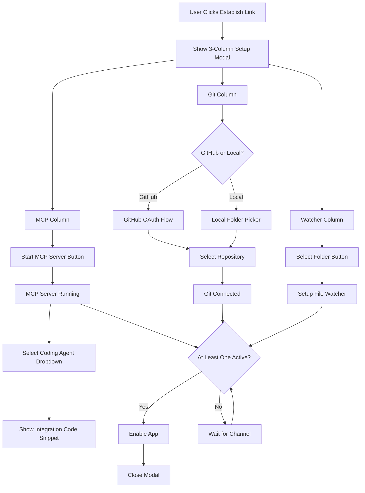

# Input Channels Implementation Plan

## Overview

Implement a unified setup modal with three columns (one per input channel) that appears when user clicks "Establish Link". Each column handles its own configuration: MCP server with agent integration instructions, Git repository selection via GitHub OAuth or local folder, and folder watching via folder picker.

**Channel Requirements:**
- At least **one** channel must be connected to enable the app
- **No specific channel is required** - user can connect just MCP, just Git, just Watcher, or any combination
- **More channels are helpful** - they provide better context for draft generation, but are optional
- The app should work gracefully with any combination of connected channels

## Architecture Flow



## Implementation Steps

### 1. Create MCP Server Service

**File**: `services/mcpServerService.ts`

Create an MCP server that runs inside the BRICK app:

- `startMCPServer(port: number)` - Start MCP server on LAN
- `stopMCPServer()` - Stop the server
- `getServerUrl()` - Get server URL (for code snippet)
- `getServerStatus()` - Check if server is running
- `onContextReceived(callback)` - Handle incoming context from coding agents

**MCP Protocol Implementation:**
- WebSocket server (using `ws` package or Capacitor HTTP server)
- Listen on configurable port (default: 3000)
- Handle JSON-RPC requests from coding agents
- Receive code context, reasoning, and technical decisions
- Broadcast events to app when context received

**Dependencies:**
- `@capacitor/http` or `ws` (if Node.js runtime available)
- Or use Capacitor's HTTP server capability

### 2. Create Agent Configuration Templates

**File**: `services/agentConfigTemplates.ts`

Store code snippets for different coding agents:

- `getConfigForAgent(agentType: AgentType): string` - Get config snippet
- Agent types: Claude Desktop, Windsurf, Cursor, etc.
- Each returns formatted JSON/YAML config showing how to add BRICK's MCP server

**Example format:**
```json
{
  "mcpServers": {
    "brick": {
      "url": "ws://YOUR_IP:3000",
      "command": "npx",
      "args": ["-y", "@modelcontextprotocol/server-brick"]
    }
  }
}
```

### 3. Create Git Service with GitHub OAuth

**File**: `services/gitService.ts`

Handle both GitHub and local git repos:

- `connectGitHub()` - Initiate GitHub OAuth flow
- `handleGitHubCallback(code: string)` - Handle OAuth callback
- `listGitHubRepos()` - List user's GitHub repositories
- `selectGitHubRepo(repo: string)` - Connect to selected repo
- `selectLocalRepo(folderPath: string)` - Connect to local git repo
- `setupGitHooks()` - Install git hooks to capture commits
- `onCommit(callback)` - Handle commit events

**GitHub OAuth Flow:**
- Use GitHub OAuth app credentials
- Redirect to GitHub authorization
- Handle callback with authorization code
- Exchange for access token
- Use GitHub API to list repositories

**Dependencies:**
- `@capacitor/browser` - For OAuth redirect
- `@octokit/rest` - GitHub API client
- Or use Capacitor HTTP plugin for API calls

### 4. Create File Watcher Service

**File**: `services/fileWatcherService.ts`

Watch folders for file changes:

- `selectFolder()` - Open Capacitor folder picker
- `watchFolder(folderPath: string)` - Start watching folder
- `stopWatching(folderPath: string)` - Stop watching
- `getWatchedFolders()` - List all watched folders
- `onFileChange(callback)` - Handle file change events

**Implementation:**
- Use `@capacitor/filesystem` for folder picker
- Use file system watcher or polling to detect changes
- Filter by file extensions (`.ts`, `.tsx`, `.js`, etc.)
- Respect privacy patterns (ignore `.env`, `secrets/*`)
- Emit events when files change

### 5. Create Setup Modal Component

**File**: `components/InputChannelsSetupModal.tsx`

Three-column modal layout:

**Column 1 - MCP Server:**
- "Start MCP Server" button (shows status: Stopped/Running)
- Dropdown: Select Coding Agent (Claude, Windsurf, Cursor, etc.)
- Code snippet display area (shows config based on selected agent)
- Copy button for code snippet
- Instructions text: "Add this to your [Agent] config file"
- Status indicator: Server URL, connection count

**Column 2 - Git Repository:**
- Toggle/Radio: "GitHub" or "Local Folder"
- If GitHub:
  - "Connect GitHub" button (opens OAuth flow)
  - Repository dropdown (populated after OAuth)
  - "Select Repository" button
- If Local Folder:
  - "Select Git Repository" button (opens folder picker)
- Status indicator: Connected repo path/name

**Column 3 - Folder Watcher:**
- "Select Folder to Watch" button (opens folder picker)
- List of watched folders (with remove buttons)
- "Add Another Folder" button
- Status indicator: Number of folders watched

**Modal Footer:**
- "Done" button (enabled when at least one channel is active - any channel works)
- "Cancel" button
- Note: At least one channel must be connected, but no specific channel is required. More channels provide better context but are optional.

### 6. Update App.tsx - Open Modal

**File**: `App.tsx`

Replace the boolean toggle with modal state:

```typescript
const [showSetupModal, setShowSetupModal] = useState(false);
const [inputChannels, setInputChannels] = useState<InputChannelStatus>({
  mcp: { active: false, serverUrl: null },
  git: { active: false, repoPath: null },
  watcher: { active: false, folders: [] }
});

const handleEstablishLink = () => {
  setShowSetupModal(true);
};

const handleSetupComplete = (channels: InputChannelStatus) => {
  // Validate: at least one channel must be active
  const hasActiveChannel = 
    channels.mcp.active || 
    channels.git.active || 
    channels.watcher.active;
  
  if (!hasActiveChannel) {
    // Show error: "Please connect at least one channel"
    return;
  }
  
  setInputChannels(channels);
  setShowSetupModal(false);
  // Enable app features (works with any combination of channels)
};
```

### 7. Create Input Channels Context

**File**: `contexts/InputChannelsContext.tsx`

Provide channel state and events throughout app:

- Channel status (active/inactive, details)
- MCP context events → trigger draft generation
- Git commit events → trigger draft generation
- File change events → trigger draft generation

### 8. Update DraftsPanel to Use Real Context

**File**: `components/DraftsPanel.tsx`

Replace `SAMPLE_CODE_SNIPPET` with real context:

- Listen to InputChannelsContext
- When MCP context received → use for draft generation
- When git commit → capture commit message + diff
- When file changes → capture diff

### 9. Update Settings Panel

**File**: `components/SettingsPanel.tsx`

Replace protocol toggles with real status:

- Show MCP server status (running/stopped, URL, connections)
- Show Git repo (GitHub repo name or local path)
- List watched folders (with remove buttons)
- "Reconfigure" button → opens setup modal again

### 10. State Persistence

**File**: `services/storageService.ts`

Use Capacitor Preferences to persist:

- MCP server port and status
- Selected coding agent type
- GitHub access token (encrypted)
- Selected GitHub repo or local git path
- Watched folder paths
- Channel enable/disable states

## File Structure

```
services/
  ├── mcpServerService.ts          # MCP server implementation
  ├── agentConfigTemplates.ts       # Agent config code snippets
  ├── gitService.ts                 # GitHub OAuth + local git
  ├── fileWatcherService.ts         # File watching
  └── storageService.ts             # Persistence

components/
  ├── InputChannelsSetupModal.tsx   # 3-column setup modal
  └── (update) SettingsPanel.tsx    # Show real status

contexts/
  └── InputChannelsContext.tsx      # React context for channels

types/
  └── inputChannels.ts              # Type definitions
```

## User Flow

1. User clicks "Establish Link" → Modal opens with 3 columns
2. **Column 1 (MCP):**
   - Click "Start MCP Server" → Server starts, shows URL
   - Select coding agent from dropdown
   - Code snippet appears → User copies to their agent config
3. **Column 2 (Git):**
   - Choose "GitHub" or "Local Folder"
   - If GitHub → OAuth flow → Select repo
   - If Local → Folder picker → Select git repo folder
4. **Column 3 (Folder Watcher):**
   - Click "Select Folder" → Folder picker → Select folder
   - Folder appears in list
   - Can add more folders
5. Click "Done" → Modal closes, app enabled (requires at least one channel active)
   - User can connect any combination: just MCP, just Git, just Watcher, or any combination
   - More channels = better context, but only one is required

## Dependencies to Add

```json
{
  "dependencies": {
    "@capacitor/browser": "^latest",      // OAuth redirects
    "@capacitor/filesystem": "^latest",    // Folder picker
    "@capacitor/preferences": "^latest",   // Storage
    "@octokit/rest": "^latest"             // GitHub API (or use Capacitor HTTP)
  }
}
```

**Note for MCP Server:**
- Need to evaluate if Capacitor app can run Node.js server (probably need backend)
- Or use Capacitor HTTP server plugin
- Or run separate Node.js process that app connects to

## Type Definitions

**File**: `types/inputChannels.ts`

```typescript
export type AgentType = 'claude-desktop' | 'windsurf' | 'cursor' | 'other';

export interface InputChannelStatus {
  mcp: {
    active: boolean;
    serverUrl: string | null;
    port: number | null;
    agentType: AgentType | null;
    connections: number;
  };
  git: {
    active: boolean;
    repoPath: string | null;
    repoType: 'github' | 'local' | null;
    githubRepo?: string;
  };
  watcher: {
    active: boolean;
    folders: string[];
  };
}

export interface MCPContextEvent {
  type: 'code-context' | 'reasoning' | 'decision';
  content: string;
  timestamp: number;
}

export interface GitCommitEvent {
  message: string;
  hash: string;
  diff: string;
  timestamp: number;
}

export interface FileChangeEvent {
  filePath: string;
  changeType: 'created' | 'modified' | 'deleted';
  diff?: string;
  timestamp: number;
}
```

## Success Criteria

- One button opens modal with all setup options
- MCP server starts with one click
- Agent config snippets are accurate and copyable
- GitHub OAuth flow works seamlessly
- Local git repo selection works
- Folder watching works and persists
- **At least one channel required to enable app (any channel works, no specific one required)**
- **More channels are helpful but optional - user can connect just one or all three**
- Settings panel shows real status
- All state persists across app restarts
- Events from all channels trigger draft generation
- App gracefully handles any combination of connected channels

## Technical Considerations

### MCP Server Architecture

**Option 1: Node.js Backend**
- Run separate Node.js server process
- BRICK app connects via WebSocket
- Most flexible, can use full MCP SDK

**Option 2: Capacitor HTTP Server**
- Use Capacitor's HTTP server plugin
- Run server within app
- Limited by Capacitor capabilities

**Option 3: Cloud/Remote Server**
- Host MCP server remotely
- App connects to remote endpoint
- Requires internet, more complex setup

**Recommendation**: Start with Option 1 (Node.js backend) for flexibility, can optimize later.

### GitHub OAuth

- Create GitHub OAuth App
- Store client ID/secret securely
- Use Capacitor Browser plugin for redirect
- Store access token encrypted in Preferences
- Handle token refresh

### File Watching

- Use Capacitor Filesystem API for folder selection
- Implement polling or native file watcher
- Filter by extensions and privacy patterns
- Batch change events to avoid spam

### Git Hooks

- Install post-commit hook in selected repo
- Hook sends commit data to BRICK app
- Handle hook failures gracefully
- Support multiple repos

## Next Steps

1. Set up project structure and dependencies
2. Implement MCP server service
3. Create agent config templates
4. Build GitHub OAuth flow
5. Implement file watcher
6. Create setup modal component
7. Integrate with existing app
8. Add state persistence
9. Update Settings panel
10. Test end-to-end flow

