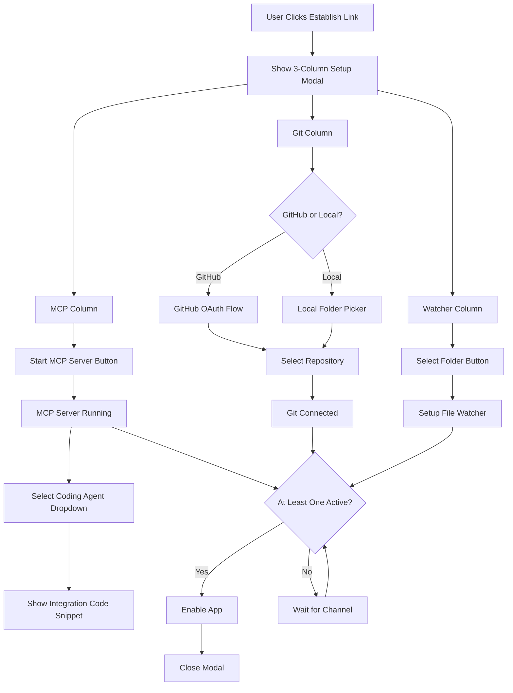

# Input & Output Channels Implementation Plan

## Overview

This plan covers both **Input Channels** (how content comes into BRICK) and **Output Channels** (where BRICK posts content).

### Input Channels
Implement a unified setup modal with three columns (one per input channel) that appears when user clicks "Establish Link". Each column handles its own configuration: MCP server with agent integration instructions, Git repository selection via GitHub OAuth or local folder, and folder watching via folder picker.

### Output Channels
Implement real OAuth flows in the onboarding process to connect user accounts on X, Reddit, Discord, and Email. These connections allow BRICK to post content on behalf of the user. Reference implementation: [contentport](https://github.com/joschan21/contentport) for X/Twitter OAuth example.

**Channel Requirements:**
- At least **one** channel must be connected to enable the app
- **No specific channel is required** - user can connect just MCP, just Git, just Watcher, or any combination
- **More channels are helpful** - they provide better context for draft generation, but are optional
- The app should work gracefully with any combination of connected channels

## Architecture Flow



## Implementation Steps

### 1. Create MCP Server Service

**File**: `services/mcpServerService.ts`

Create an MCP server that runs inside the BRICK app:

- `startMCPServer(port: number)` - Start MCP server on LAN (supports both WebSocket and HTTP)
- `stopMCPServer()` - Stop the server
- `getServerUrl()` - Get server URLs (returns both WebSocket `ws://` and HTTP `http://` URLs for code snippets)
- `getServerStatus()` - Check if server is running
- `onContextReceived(callback)` - Handle incoming summaries from coding agents

**MCP Protocol Implementation:**
- **Dual transport support:**
  - WebSocket server (for Cursor) - `ws://YOUR_IP:3000`
  - HTTP server (for Claude Code) - `http://YOUR_IP:3000/mcp`
- Listen on configurable port (default: 3000)
- Handle JSON-RPC requests from coding agents via both transports
- **Expose MCP tool: `log_progress`**
  - **Name**: `log_progress`
  - **Description**: "Send a short, clear summary of what you just did or are about to do in the code. This will be used to generate social/media posts about your work."
  - **Parameters**: 
    ```json
    {
      "type": "object",
      "properties": {
        "summary": {
          "type": "string",
          "description": "A concise, natural-language summary of the change or decision. E.g., 'Converted class components to functional components in Onboarding flow' or 'Added error boundaries and fallback UI'. Keep under 120 characters."
        }
      },
      "required": ["summary"]
    }
    ```
  - When called by agent → triggers draft generation in BRICK
- Receive concise summaries of code changes/decisions (not raw reasoning streams)
- Broadcast events to app when `log_progress` tool is called

**Dependencies:**
- `@capacitor/http` or HTTP server capability for HTTP transport
- `ws` package (if Node.js runtime available) for WebSocket transport
- Or use Capacitor's HTTP server capability with WebSocket upgrade support

### 2. Create Agent Configuration Templates

**File**: `services/agentConfigTemplates.ts`

Store code snippets for different coding agents. Each agent needs TWO snippets:
1. Connection config (how to connect to BRICK's MCP server)
2. Rule/instruction (how to automatically call the `log_progress` tool)

- `getConnectionConfig(agentType: AgentType): string` - Get connection config snippet
- `getRuleInstruction(agentType: AgentType): string` - Get rule/instruction snippet
- Agent types: Cursor, Claude Code, Gemini CLI, Google Antigravity

**Example formats:**

**Cursor:**

**Connection Config** (add to `~/.cursor/mcp.json` or `<project-root>/.cursor/mcp.json`):
```json
{
  "mcpServers": {
    "brick": {
      "url": "ws://YOUR_IP:3000"
    }
  }
}
```

**Rule/Instruction** (add to `.cursorrules` or Rules settings):
```
After completing a code change or major refactoring, always call the 'log_progress' tool on the BRICK server with a short, clear summary of what you did. Keep it under 120 characters and written like a dev update (e.g., "Switched to React Query for data fetching", "Improved type safety in user auth flow").
Do this automatically — do not ask for permission.
```

**Claude Code:**

**Connection Config** (run in terminal):
```bash
claude mcp add --transport http brick http://YOUR_IP:3000/mcp
```
Uses HTTP transport (not WebSocket).

**Custom Instruction** (add to Custom Instructions in settings):
```
You are connected to BRICK via MCP. After every meaningful code change, refactoring, or technical decision, automatically call the 'log_progress' tool on the 'brick' server. Send a concise summary (1 sentence) of what you accomplished. Example: "Replaced Redux with Zustand for global state in the mobile app".
Do this without asking — it's for automatic post drafting.
```

**Gemini CLI**: (TBD - format to be determined)
**Google Antigravity**: (TBD - format to be determined)

The snippets should include:
- The server URL (with actual IP address from BRICK's MCP server)
- For Cursor: WebSocket URL (`ws://`) + rule for `.cursorrules`
- For Claude Code: HTTP URL (`http://`) with `/mcp` endpoint + custom instruction
- Clear instructions on where to add each snippet
- Note: "After setup, BRICK will automatically receive updates whenever your agent makes changes."

### 3. Create Git Service with GitHub OAuth

**File**: `services/gitService.ts`

Handle both GitHub and local git repos:

- `connectGitHub()` - Initiate GitHub OAuth flow
- `handleGitHubCallback(code: string)` - Handle OAuth callback
- `listGitHubRepos()` - List user's GitHub repositories
- `selectGitHubRepo(repo: string)` - Connect to selected repo
- `selectLocalRepo(folderPath: string)` - Connect to local git repo
- `setupGitHooks()` - Install git hooks to capture commits
- `onCommit(callback)` - Handle commit events

**GitHub OAuth Flow:**
- Use GitHub OAuth app credentials
- Redirect to GitHub authorization
- Handle callback with authorization code
- Exchange for access token
- Use GitHub API to list repositories

**Dependencies:**
- `@capacitor/browser` - For OAuth redirect
- `@octokit/rest` - GitHub API client
- Or use Capacitor HTTP plugin for API calls

### 4. Create File Watcher Service

**File**: `services/fileWatcherService.ts`

Watch folders for file changes:

- `selectFolder()` - Open Capacitor folder picker
- `watchFolder(folderPath: string)` - Start watching folder
- `stopWatching(folderPath: string)` - Stop watching
- `getWatchedFolders()` - List all watched folders
- `onFileChange(callback)` - Handle file change events

**Implementation:**
- Use `@capacitor/filesystem` for folder picker
- Use file system watcher or polling to detect changes
- Filter by file extensions (`.ts`, `.tsx`, `.js`, etc.)
- Respect privacy patterns (ignore `.env`, `secrets/*`)
- Emit events when files change

### 5. Create Setup Modal Component

**File**: `components/InputChannelsSetupModal.tsx`

Three-column modal layout:

**Column 1 - MCP Server:**
- "Start MCP Server" button (shows status: Stopped/Running)
- Dropdown: Select Coding Agent (Cursor, Claude Code, Gemini CLI, Google Antigravity)
- **Two copyable blocks displayed:**
  1. **Connection Config** - JSON config or CLI command (based on agent)
     - **Cursor**: JSON config snippet for `.cursor/mcp.json` (WebSocket URL)
     - **Claude Code**: CLI command to run in terminal (HTTP URL)
     - **Other agents**: TBD format
  2. **Rule/Instruction** - The rule or custom instruction to add
     - **Cursor**: Rule for `.cursorrules` file
     - **Claude Code**: Custom instruction for settings
     - **Other agents**: TBD format
- Copy buttons for each snippet (separate copy buttons)
- Instructions text:
  - **Cursor**: "1. Add connection config to `.cursor/mcp.json` 2. Add rule to `.cursorrules`"
  - **Claude Code**: "1. Run connection command in terminal 2. Add custom instruction to settings"
- Status indicator: Server URL (shows both WebSocket and HTTP endpoints), connection count
- Note: "After setup, BRICK will automatically receive updates whenever your agent makes changes."

**Column 2 - Git Repository:**
- Toggle/Radio: "GitHub" or "Local Folder"
- If GitHub:
  - "Connect GitHub" button (opens OAuth flow)
  - Repository dropdown (populated after OAuth)
  - "Select Repository" button
- If Local Folder:
  - "Select Git Repository" button (opens folder picker)
- Status indicator: Connected repo path/name

**Column 3 - Folder Watcher:**
- "Select Folder to Watch" button (opens folder picker)
- List of watched folders (with remove buttons)
- "Add Another Folder" button
- Status indicator: Number of folders watched

**Modal Footer:**
- "Done" button (enabled when at least one channel is active - any channel works)
- "Cancel" button
- Note: At least one channel must be connected, but no specific channel is required. More channels provide better context but are optional.

### 6. Update App.tsx - Open Modal

**File**: `App.tsx`

Replace the boolean toggle with modal state:

```typescript
const [showSetupModal, setShowSetupModal] = useState(false);
const [inputChannels, setInputChannels] = useState<InputChannelStatus>({
  mcp: { active: false, serverUrl: null },
  git: { active: false, repoPath: null },
  watcher: { active: false, folders: [] }
});

const handleEstablishLink = () => {
  setShowSetupModal(true);
};

const handleSetupComplete = (channels: InputChannelStatus) => {
  // Validate: at least one channel must be active
  const hasActiveChannel = 
    channels.mcp.active || 
    channels.git.active || 
    channels.watcher.active;
  
  if (!hasActiveChannel) {
    // Show error: "Please connect at least one channel"
    return;
  }
  
  setInputChannels(channels);
  setShowSetupModal(false);
  // Enable app features (works with any combination of channels)
};
```

### 7. Create Input Channels Context

**File**: `contexts/InputChannelsContext.tsx`

Provide channel state and events throughout app:

- Channel status (active/inactive, details)
- MCP context events → trigger draft generation
- Git commit events → trigger draft generation
- File change events → trigger draft generation

### 8. Update DraftsPanel to Use Real Context

**File**: `components/DraftsPanel.tsx`

Replace `SAMPLE_CODE_SNIPPET` with real context:

- Listen to InputChannelsContext
- When MCP `log_progress` tool is called → receive summary → use for draft generation
- When git commit → capture commit message + diff
- When file changes → capture diff
- Display context source: "New context from agent: 'Migrated to TypeScript strict mode'"

### 9. Update Settings Panel

**File**: `components/SettingsPanel.tsx`

Replace protocol toggles with real status:

- Show MCP server status (running/stopped, URL, connections)
- Show Git repo (GitHub repo name or local path)
- List watched folders (with remove buttons)
- "Reconfigure" button → opens setup modal again

### 10. State Persistence

**File**: `services/storageService.ts`

Use Capacitor Preferences to persist:

- MCP server port and status
- Selected coding agent type
- GitHub access token (encrypted)
- Selected GitHub repo or local git path
- Watched folder paths
- Channel enable/disable states

## File Structure

```
services/
  ├── mcpServerService.ts          # MCP server implementation
  ├── agentConfigTemplates.ts       # Agent config code snippets
  ├── gitService.ts                 # GitHub OAuth + local git
  ├── fileWatcherService.ts         # File watching
  └── storageService.ts             # Persistence

components/
  ├── InputChannelsSetupModal.tsx   # 3-column setup modal
  └── (update) SettingsPanel.tsx    # Show real status

contexts/
  └── InputChannelsContext.tsx      # React context for channels

types/
  └── inputChannels.ts              # Type definitions
```

## User Flow

1. User clicks "Establish Link" → Modal opens with 3 columns
2. **Column 1 (MCP):**
   - Click "Start MCP Server" → Server starts, shows URL
   - Select coding agent from dropdown
   - **Two snippets appear:**
     - Connection config → User copies and adds to agent config
     - Rule/instruction → User copies and adds to agent rules/instructions
   - After setup, agent will automatically call `log_progress` tool when making changes
3. **Column 2 (Git):**
   - Choose "GitHub" or "Local Folder"
   - If GitHub → OAuth flow → Select repo
   - If Local → Folder picker → Select git repo folder
4. **Column 3 (Folder Watcher):**
   - Click "Select Folder" → Folder picker → Select folder
   - Folder appears in list
   - Can add more folders
5. Click "Done" → Modal closes, app enabled (requires at least one channel active)
   - User can connect any combination: just MCP, just Git, just Watcher, or any combination
   - More channels = better context, but only one is required

## Dependencies to Add

```json
{
  "dependencies": {
    "@capacitor/browser": "^latest",      // OAuth redirects
    "@capacitor/filesystem": "^latest",    // Folder picker
    "@capacitor/preferences": "^latest",   // Storage
    "@octokit/rest": "^latest"             // GitHub API (or use Capacitor HTTP)
  }
}
```

**Note for MCP Server:**
- Need to evaluate if Capacitor app can run Node.js server (probably need backend)
- Or use Capacitor HTTP server plugin
- Or run separate Node.js process that app connects to

## Type Definitions

**File**: `types/inputChannels.ts`

```typescript
export type AgentType = 'claude-desktop' | 'windsurf' | 'cursor' | 'other';

export interface InputChannelStatus {
  mcp: {
    active: boolean;
    serverUrl: string | null;
    port: number | null;
    agentType: AgentType | null;
    connections: number;
  };
  git: {
    active: boolean;
    repoPath: string | null;
    repoType: 'github' | 'local' | null;
    githubRepo?: string;
  };
  watcher: {
    active: boolean;
    folders: string[];
  };
}

export interface MCPContextEvent {
  type: 'log_progress';
  summary: string; // Concise summary from agent (under 120 characters)
  timestamp: number;
}

export interface GitCommitEvent {
  message: string;
  hash: string;
  diff: string;
  timestamp: number;
}

export interface FileChangeEvent {
  filePath: string;
  changeType: 'created' | 'modified' | 'deleted';
  diff?: string;
  timestamp: number;
}
```

## Success Criteria

- One button opens modal with all setup options
- MCP server starts with one click
- Agent config snippets are accurate and copyable
- GitHub OAuth flow works seamlessly
- Local git repo selection works
- Folder watching works and persists
- **At least one channel required to enable app (any channel works, no specific one required)**
- **More channels are helpful but optional - user can connect just one or all three**
- Settings panel shows real status
- All state persists across app restarts
- Events from all channels trigger draft generation
- App gracefully handles any combination of connected channels

## Technical Considerations

### MCP Server Architecture

**Option 1: Node.js Backend**
- Run separate Node.js server process
- BRICK app connects via HTTP/WebSocket (supports both transports)
- Most flexible, can use full MCP SDK

**Option 2: Capacitor HTTP Server**
- Use Capacitor's HTTP server plugin
- Run server within app
- Limited by Capacitor capabilities

**Option 3: Cloud/Remote Server**
- Host MCP server remotely
- App connects to remote endpoint
- Requires internet, more complex setup

**Recommendation**: Start with Option 1 (Node.js backend) for flexibility, can optimize later.

### GitHub OAuth

- Create GitHub OAuth App
- Store client ID/secret securely
- Use Capacitor Browser plugin for redirect
- Store access token encrypted in Preferences
- Handle token refresh

### File Watching

- Use Capacitor Filesystem API for folder selection
- Implement polling or native file watcher
- Filter by extensions and privacy patterns
- Batch change events to avoid spam

### Git Hooks

- Install post-commit hook in selected repo
- Hook sends commit data to BRICK app
- Handle hook failures gracefully
- Support multiple repos

## Output Channels Implementation

### Overview
Replace the simulated OAuth connections in the onboarding flow with real OAuth implementations that allow BRICK to post content on behalf of users.

### Reference Implementation
- **X/Twitter OAuth**: See [contentport](https://github.com/joschan21/contentport) for a working example of X OAuth integration
- ContentPort successfully implements X OAuth to post tweets on behalf of users

### Implementation Steps

#### 1. Create OAuth Service Layer

**File**: `services/oauthService.ts`

Unified service for handling OAuth flows for all platforms:

- `initiateOAuth(platform: Platform)` - Start OAuth flow for platform
  - Generate PKCE code verifier/challenge (for X/Twitter)
  - Generate state parameter
  - Store code verifier and state securely
  - Build authorization URL
  - Redirect user to platform's OAuth page
- `handleOAuthCallback(platform: Platform, code: string, state: string)` - Handle OAuth callback
  - Retrieve code verifier using state
  - Exchange authorization code for access token
  - Fetch user profile
  - Store tokens securely with expiration
  - Clean up temporary storage
- `refreshToken(platform: Platform, accountId: string)` - Refresh expired tokens
  - Check if token is expired or expiring soon
  - Exchange refresh token for new access token
  - Update stored tokens
- `ensureValidToken(platform: Platform, accountId: string)` - Ensure token is valid before API calls
  - Check expiration
  - Auto-refresh if needed
  - Return valid access token
- `revokeConnection(platform: Platform)` - Disconnect platform
- `getConnectionStatus(platform: Platform)` - Check if platform is connected
- `storeTokens(platform: Platform, tokens: OAuthTokens)` - Securely store tokens

**OAuth Flow Pattern (OAuth 2.0 with PKCE for X/Twitter):**
1. User clicks "Connect X/Reddit/Discord/Email" in onboarding
2. Generate PKCE code verifier and challenge
3. Store code verifier with state parameter (temporary, 10 min expiry)
4. Redirect to platform's OAuth authorization page with PKCE challenge
5. User authorizes BRICK
6. Platform redirects back with authorization code and state
7. Retrieve code verifier using state
8. Exchange code for access token (include code verifier for PKCE)
9. Receive access token, refresh token, and expiration time
10. Store tokens securely (encrypted) with expiration
11. Update UI to show connected status
12. Clean up temporary storage

#### 2. X/Twitter OAuth Implementation

**File**: `services/xOAuthService.ts`

- Use Twitter API v2 OAuth 2.0 with PKCE (Proof Key for Code Exchange)
- Create Twitter Developer App to get Client ID and Client Secret
- Implement OAuth 2.0 Authorization Code Flow with PKCE
- Scopes needed: `tweet.read`, `tweet.write`, `users.read`, `offline.access`, `media.write`
- Store access token, refresh token, and expiration time securely
- Reference: [contentport X OAuth implementation](https://github.com/joschan21/contentport)

**OAuth 2.0 Flow with PKCE:**

**1. Initiate Connection:**
- Generate PKCE code verifier (random 43-128 character string)
- Generate code challenge (SHA256 hash of verifier, base64url encoded)
- Store code verifier in secure storage (Redis or encrypted storage) with state parameter
- Build authorization URL with:
  - `response_type=code`
  - `client_id` (Twitter Client ID)
  - `redirect_uri` (callback URL)
  - `scope=tweet.read tweet.write users.read offline.access media.write`
  - `state` (random state for security)
  - `code_challenge` (PKCE challenge)
  - `code_challenge_method=S256`
- Redirect user to authorization URL

**2. OAuth Callback & Token Exchange:**
- Receive authorization code and state from callback
- Retrieve code verifier from storage using state
- Exchange authorization code for access token:
  - POST to `https://api.twitter.com/2/oauth2/token`
  - Include `grant_type=authorization_code`
  - Include `code`, `redirect_uri`, `code_verifier` (PKCE verification)
  - Use Basic Auth with Client ID:Secret
- Receive tokens: `access_token`, `refresh_token`, `expires_in`, `scope`, `token_type`
- Fetch user profile using access token
- Store tokens securely with expiration time
- Clean up temporary storage

**3. Using Access Tokens:**
- Use Bearer token authentication (no request signing needed!)
- Simple API calls: `Authorization: Bearer {access_token}`
- Post Tweet: `POST https://api.twitter.com/2/tweets` with Bearer token

**4. Token Refresh:**
- Check token expiration before API calls
- If expired or expiring soon (within 5 minutes), refresh:
  - POST to `https://api.twitter.com/2/oauth2/token`
  - Include `grant_type=refresh_token`
  - Include `refresh_token`
  - Receive new `access_token` and `refresh_token`
  - Update stored tokens with new expiration time

**5. Automatic Token Refresh Middleware:**
- Check token expiration before each API call
- Automatically refresh if expired or expiring soon
- Re-fetch account to get new token
- Seamless user experience (no re-authentication needed)

**Endpoints:**
- Authorization URL: `https://twitter.com/i/oauth2/authorize`
- Token URL: `https://api.twitter.com/2/oauth2/token`
- Post Tweet: `POST https://api.twitter.com/2/tweets`
- User Profile: `GET https://api.twitter.com/2/users/me`

**Benefits of OAuth 2.0 over OAuth 1.0a:**
- Simpler API calls: Bearer tokens, no request signing required
- Token expiration: Better security with automatic refresh
- PKCE: Mitigates authorization code interception attacks
- Standard: More widely supported and documented
- Better token management: Refresh tokens for long-lived access
- No access secret needed: Simpler credential storage

#### 3. Reddit OAuth Implementation

**File**: `services/redditOAuthService.ts`

- Use Reddit OAuth 2.0
- Create Reddit App to get Client ID and Client Secret
- Implement OAuth 2.0 Authorization Code Flow
- Scopes needed: `submit`, `read`, `identity`
- Store access token and refresh token

**Endpoints:**
- Authorization URL: `https://www.reddit.com/api/v1/authorize`
- Token URL: `https://www.reddit.com/api/v1/access_token`
- Submit Post: `POST https://oauth.reddit.com/api/submit`

#### 4. Discord OAuth Implementation

**File**: `services/discordOAuthService.ts`

- Use Discord OAuth 2.0
- Create Discord Application to get Client ID and Client Secret
- Implement OAuth 2.0 Authorization Code Flow
- Scopes needed: `bot`, `messages.write` (or use webhook if bot-based)
- Alternative: Use Discord Webhooks (simpler, no OAuth needed)

**Endpoints:**
- Authorization URL: `https://discord.com/api/oauth2/authorize`
- Token URL: `https://discord.com/api/oauth2/token`
- Send Message: `POST https://discord.com/api/channels/{channel_id}/messages`

**Note**: Discord posting can be done via:
- Bot OAuth (requires bot token, more complex)
- Webhooks (simpler, user creates webhook URL)
- Consider offering both options

#### 5. Email OAuth Implementation

**File**: `services/emailOAuthService.ts`

- Use Gmail/Outlook OAuth 2.0 (or IMAP with OAuth)
- Gmail: Use Google OAuth 2.0
- Outlook: Use Microsoft OAuth 2.0
- Scopes needed: `send` permission
- Store access token and refresh token

**Gmail Endpoints:**
- Authorization URL: `https://accounts.google.com/o/oauth2/v2/auth`
- Token URL: `https://oauth2.googleapis.com/token`
- Send Email: `POST https://gmail.googleapis.com/gmail/v1/users/me/messages/send`

**Outlook Endpoints:**
- Authorization URL: `https://login.microsoftonline.com/common/oauth2/v2.0/authorize`
- Token URL: `https://login.microsoftonline.com/common/oauth2/v2.0/token`
- Send Email: `POST https://graph.microsoft.com/v1.0/me/sendMail`

#### 6. Add "Follow us on X!" Step to Onboarding Flow

**File**: `components/Onboarding.tsx`

Add a new step in the onboarding flow (insert between current steps, e.g., as step 4.5 or before the connections step):

**Step: "Follow us on X!"**
- Display message: "Follow us on X!"
- Include X/Twitter branding/icon
- Add a "Follow" button/link that opens X profile in new tab/window
- **Next button styling**: Make the "Next" button clickable but styled with a muted/gray color (`bg-[#111] text-df-gray`) to create the visual impression that following is required, even though it's not actually required to proceed
- User can click "Next" without following, but the button color suggests they should follow first
- After clicking "Next", proceed to the connections step (current step 5)

**Implementation Notes:**
- This is a social growth tactic - encourages following but doesn't block progress
- Button should be visually distinct from the enabled state (white/orange) to create the desired psychological effect
- Consider adding a subtle animation or visual cue when user clicks "Follow" to provide feedback

#### 7. Update Onboarding Component

**File**: `components/Onboarding.tsx`

Replace simulated `handleConnect` function with real OAuth flows:

```typescript
const handleConnect = async (platform: Platform) => {
  if (config[platform]) return; // Already connected
  
  try {
    await initiateOAuth(platform);
    // OAuth flow will redirect, then callback will update state
  } catch (error) {
    // Show error message
  }
};
```

**Changes:**
- Remove `setTimeout` simulation
- Call real OAuth service
- Handle OAuth callback in app (via URL params or deep link)
- Update connection status based on OAuth result
- Show loading state during OAuth flow
- Handle errors gracefully

#### 8. Create OAuth Callback Handler

**File**: `components/OAuthCallback.tsx` or handle in `App.tsx`

Handle OAuth redirects:
- Detect OAuth callback in URL
- Extract authorization code
- Exchange code for tokens
- Store tokens securely
- Update connection status
- Redirect back to onboarding or main app

#### 9. Create Posting Service

**File**: `services/postingService.ts`

Service to post drafts to connected platforms:

- `postToPlatform(platform: Platform, draft: Draft)` - Post draft to platform
- `postToX(content: string, mediaUrls?: string[])` - Post to X/Twitter
- `postToReddit(subreddit: string, title: string, content: string)` - Post to Reddit
- `postToDiscord(webhookUrl: string, content: string)` - Post to Discord
- `sendEmail(to: string, subject: string, content: string)` - Send email

**Platform-specific formatting:**
- **X/Twitter**: 
  - Handle character limits (280 for regular, 25,000 for premium)
  - Support threads (multiple tweets)
  - Media attachments (images, videos)
  - Use Bearer token authentication: `Authorization: Bearer {access_token}`
  - Auto-refresh token if expired before posting
- **Reddit**: Format markdown, handle subreddit selection
- **Discord**: Format Discord markdown, handle channels
- **Email**: Format HTML/text, handle recipients

**PKCE Helper Functions Needed:**

**File**: `utils/pkce.ts`

```typescript
// Generate random code verifier (43-128 characters)
export function generateCodeVerifier(): string {
  const array = new Uint8Array(32);
  crypto.getRandomValues(array);
  return base64UrlEncode(array);
}

// Generate code challenge from verifier (SHA256 hash, base64url encoded)
export async function generateCodeChallenge(verifier: string): Promise<string> {
  const encoder = new TextEncoder();
  const data = encoder.encode(verifier);
  const digest = await crypto.subtle.digest('SHA-256', data);
  return base64UrlEncode(new Uint8Array(digest));
}

// Base64 URL encoding helper
function base64UrlEncode(buffer: Uint8Array): string {
  return btoa(String.fromCharCode(...buffer))
    .replace(/\+/g, '-')
    .replace(/\//g, '_')
    .replace(/=/g, '');
}
```

#### 9. Update DraftsPanel

**File**: `components/DraftsPanel.tsx`

Replace simulated `handlePost` with real posting:

```typescript
const handlePost = async () => {
  if (!currentDraft) return;
  
  try {
    await postToPlatform(currentDraft.platform, currentDraft);
    // Show success message
    // Move to history
  } catch (error) {
    // Show error message
  }
};
```

#### 10. Secure Token Storage

**File**: `services/tokenStorageService.ts`

- Use Capacitor Secure Storage or encrypted Preferences
- Encrypt tokens before storing
- Never expose tokens in frontend code
- Handle token refresh automatically
- Clear tokens on logout/disconnect

**Dependencies:**
- `@capacitor/preferences` with encryption
- Or `@capacitor/secure-storage` plugin

#### 11. Environment Variables

Add to `.env`:

```
# X/Twitter OAuth 2.0
TWITTER_CLIENT_ID=your_twitter_client_id
TWITTER_CLIENT_SECRET=your_twitter_client_secret
TWITTER_REDIRECT_URI=your_redirect_uri
# Example: http://localhost:3000/api/auth/twitter/callback
# Or for Capacitor: capacitor://localhost/api/auth/twitter/callback

# Reddit OAuth
REDDIT_CLIENT_ID=your_reddit_client_id
REDDIT_CLIENT_SECRET=your_reddit_client_secret
REDDIT_REDIRECT_URI=your_redirect_uri

# Discord OAuth
DISCORD_CLIENT_ID=your_discord_client_id
DISCORD_CLIENT_SECRET=your_discord_client_secret
DISCORD_REDIRECT_URI=your_redirect_uri

# Email OAuth
GMAIL_CLIENT_ID=your_gmail_client_id
GMAIL_CLIENT_SECRET=your_gmail_client_secret
OUTLOOK_CLIENT_ID=your_outlook_client_id
OUTLOOK_CLIENT_SECRET=your_outlook_client_secret
```

**Note**: For security, these should ideally be stored in a backend service, not exposed in the frontend. Consider a backend proxy for OAuth flows.

#### 12. Backend Considerations

**Option 1: Backend Proxy (Recommended)**
- Create backend API to handle OAuth flows
- Store client secrets server-side (never expose to frontend)
- Use Redis or similar for temporary state/code verifier storage
- Frontend only stores access tokens (encrypted)
- More secure, prevents secret exposure
- Required for production use

**Option 2: Client-Side Only**
- Use OAuth 2.0 with PKCE for public clients
- Store code verifier in Capacitor Secure Storage temporarily
- Store tokens encrypted in Capacitor Secure Storage
- Less secure but simpler architecture
- May not work for all platforms (some require backend)

**Recommendation**: 
- **For MVP/Development**: Option 2 (client-side with PKCE)
- **For Production**: Option 1 (backend proxy) - Required for secure token management and to prevent client secret exposure

**Backend Implementation Notes:**
- Use Redis or in-memory store for PKCE code verifiers (10 min expiry)
- Store state parameter with user ID and action type
- Clean up temporary data after token exchange
- Implement automatic token refresh middleware
- Handle token expiration gracefully

## Next Steps

### Input Channels
1. Set up project structure and dependencies
2. Implement MCP server service
3. Create agent config templates
4. Build GitHub OAuth flow (for Git repo selection)
5. Implement file watcher
6. Create setup modal component
7. Integrate with existing app
8. Add state persistence
9. Update Settings panel
10. Test end-to-end flow

### Output Channels
1. Set up OAuth developer accounts (X, Reddit, Discord, Gmail/Outlook)
2. Create OAuth service layer
3. Implement X OAuth (reference contentport)
4. Implement Reddit OAuth
5. Implement Discord OAuth (or webhooks)
6. Implement Email OAuth (Gmail/Outlook)
7. Update Onboarding component with real OAuth
8. Create OAuth callback handler
9. Create posting service
10. Update DraftsPanel to use real posting
11. Implement secure token storage
12. Test OAuth flows end-to-end
13. Test posting to all platforms

